# Tender Export OS v4.1 - Complete Architecture Reference

**Version:** 4.1.2  
**Status:** Production-Ready Operating System  
**Branch:** feat/teos-production-readiness-governance

---

## Executive Summary

Tender Export OS v4.1 is a **Hermes-native operating system** for Indian government tenders and export RFQs. It combines an event-ledger control plane, a plugin-powered artifact factory (Codex), a deep research boardroom (ChatGPT), and a shared knowledge bus (Google Drive) into a single governed operating rhythm.

> **Core Principle:** *Do not build unnecessary external orchestration unless Hermes cannot do it.*

---

## System Architecture Layers

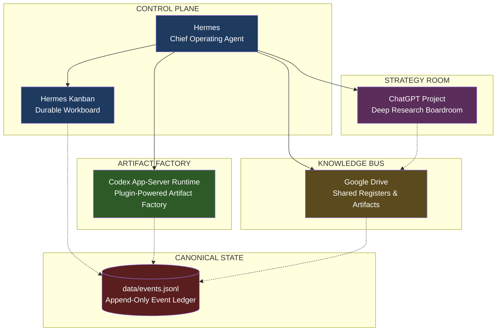

### Five-Layer Architecture

| Layer | System | Role | Key Contracts |
|-------|--------|------|---------------|
| **1. Control Plane** | Hermes | Chief Operating Agent — rhythm, approvals, Kanban, memory, routing | `HERMES.md`, `config/kanban_board.yaml`, `config/hermes_cron.yaml` |
| **2. Durable Workboard** | Hermes Kanban | Cases, tasks, blockers, approvals, handoffs, weekly learning | `config/kanban_board.yaml` |
| **3. Artifact Runtime** | Codex App-Server | File edits, parsing, spreadsheets, PDFs, DOCX, PPTX, dashboards, plugin production | `docs/CODEX_APP_SERVER_RUNTIME.md`, `config/codex_runtime_policy.yaml` |
| **4. Strategy Boardroom** | ChatGPT Project | Deep cited research, weekly review, category/export strategy | `docs/CHATGPT_BOARDROOM.md` |
| **5. Knowledge Bus** | Google Drive | Shared registers, packs, approvals, receipts, snapshots, artifacts | `docs/GOOGLE_DRIVE_KNOWLEDGE_BUS.md` |

---

## Canonical State Model

```mermaid
flowchart TB
    EL[(data/events.jsonl<br/>Append-Only Canonical<br/>Event Ledger)]
    
    EL --> MC[(master_cases.csv<br/>Case Register)]
    EL --> AR[(approvals_receipts.csv<br/>Approval Register)]
    EL --> SM[(supplier_master.csv<br/>Supplier Register)]
    EL --> QM[(quote_master.csv<br/>Quote Register)]
    EL --> SH[(source_health.csv<br/>Source Health)]
    EL --> PH[(plugin_health.csv<br/>Plugin Health)]
    EL --> BD[(buyer_demand_signals.csv<br/>Buyer Demand)]
    EL --> OQ[(outreach_queue.csv<br/>Outreach Queue)]
    EL --> CL[(communication_log.csv<br/>Comm Log)]
    
    EL --> KB[Hermes Kanban<br/>Working View]
    EL --> DB[Daily Briefs<br/>Working View]
    EL --> AC[Approval Cards<br/>Working View]
    EL --> AM[Artifact Manifests<br/>Working View]
    
    style EL fill:#5a1e1e,color:#fff,stroke:#ff6b6b,stroke-width:3px
    style MC fill:#2d3a5a,color:#fff
    style AR fill:#2d3a5a,color:#fff
    style SM fill:#2d3a5a,color:#fff
    style QM fill:#2d3a5a,color:#fff
    style SH fill:#2d3a5a,color:#fff
    style PH fill:#2d3a5a,color:#fff
    style BD fill:#2d3a5a,color:#fff
    style OQ fill:#2d3a5a,color:#fff
    style CL fill:#2d3a5a,color:#fff
    style KB fill:#1e4a2e,color:#fff
    style DB fill:#1e4a2e,color:#fff
    style AC fill:#1e4a2e,color:#fff
    style AM fill:#1e4a2e,color:#fff
```

### Key State Management Scripts

| Script | Purpose |
|--------|---------|
| `scripts/initialize_event_ledger.py` | Seeds ledger from reviewed registers |
| `scripts/rebuild_projections_from_events.py` | Rebuilds CSV projections from ledger |
| `scripts/validate_register_schemas.py` | Validates schemas and event shapes |
| `scripts/validate_case_readiness.py` | Checks quote, approval, compliance gates |
| `scripts/process_owner_decision.py` | Records decisions and receipts |
| `scripts/generate_artifact_manifest.py` | Maps artifacts and receipts per case |
| `scripts/reconcile_hermes_kanban.py` | Creates reconciliation plan |

---

## Hybrid Research + Operational Capture Model

```mermaid
flowchart LR
    subgraph "DISCOVERY [ChatGPT Deep Research]"
        DR1[Broad Market Discovery]
        DR2[Category Intelligence]
        DR3[Source Landscape Review]
        DR4[Buyer Pattern Discovery]
        DR5[Competitor Landscape]
        DR6[Strategic Opportunity Theses]
    end
    
    subgraph "STAGING [Repo]"
        ST1[stage_deep_research_leads.py]
        ST2[Evidence Level Check]
        ST3[Owner Review & Selection]
    end
    
    subgraph "OPERATIONAL CAPTURE [Python/Playwright/Codex]"
        OC1[Exact Source Monitoring]
        OC2[Portal Listing Capture]
        OC3[Document Download & Parse]
        OC4[Corrigenda Diffing]
        OC5[Dedupe & Case ID Gen]
        OC6[Event Ledger Update]
        OC7[Schema Validation]
    end
    
    subgraph "CONTROL [Hermes]"
        CT[Routing & Approvals]
    end
    
    subgraph "DECISION [Owner]"
        OW[External/Money/Legal/DSC<br/>Price/Classification/Origin]
    end
    
    DR1 --> ST1
    DR2 --> ST1
    DR3 --> ST1
    DR4 --> ST1
    DR5 --> ST1
    DR6 --> ST1
    
    ST1 --> ST2
    ST2 --> ST3
    ST3 --> OC1
    ST3 --> OC2
    
    OC1 --> OC3
    OC2 --> OC3
    OC3 --> OC4
    OC4 --> OC5
    OC5 --> OC6
    OC6 --> OC7
    
    OC7 --> CT
    CT --> OW
    
    style DR1 fill:#5a2d5a,color:#fff
    style DR2 fill:#5a2d5a,color:#fff
    style DR3 fill:#5a2d5a,color:#fff
    style DR4 fill:#5a2d5a,color:#fff
    style DR5 fill:#5a2d5a,color:#fff
    style DR6 fill:#5a2d5a,color:#fff
    style ST1 fill:#2d5a27,color:#fff
    style ST2 fill:#2d5a27,color:#fff
    style ST3 fill:#2d5a27,color:#fff
    style OC1 fill:#1e3a5f,color:#fff
    style OC2 fill:#1e3a5f,color:#fff
    style OC3 fill:#1e3a5f,color:#fff
    style OC4 fill:#1e3a5f,color:#fff
    style OC5 fill:#1e3a5f,color:#fff
    style OC6 fill:#1e3a5f,color:#fff
    style OC7 fill:#1e3a5f,color:#fff
    style CT fill:#5a4a1e,color:#fff
    style OW fill:#5a1e1e,color:#fff
```

### Decision Rule

| If the task needs... | Route to... |
|---------------------|-------------|
| Broad judgment across unknown sources, markets, categories | **ChatGPT Scheduled Deep Research** |
| Exact repetition on known sources, portal listing capture | **Python/Playwright + Codex** |
| Login/session/download/BOQ parsing | **Python/Playwright with approval boundaries** |
| Market/category/source discovery | **ChatGPT Deep Research** |
| Memory, dedupe, approvals, tests, schema validation | **Repo/Python (local)** |

### Evidence Levels (Critical Distinction)

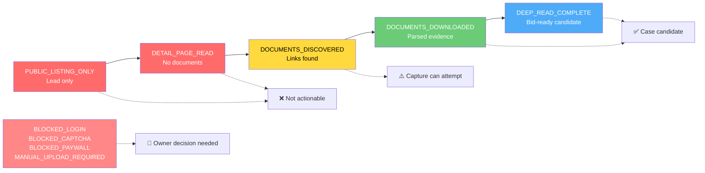

> **Never:** Treat `PUBLIC_LISTING_ONLY` as bid-ready. Never let Deep Research bypass Fast Kill, supplier proof, or approval gates.

---

## Agent Pipeline Flow

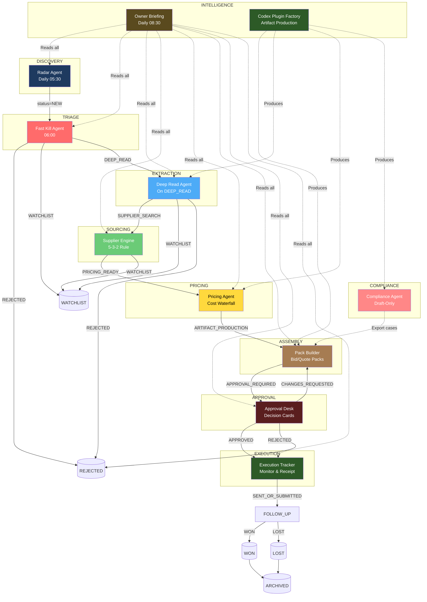

---

## Agent Roster (11 Agents)

### Agent 0 — Hermes Chief Operator (Control Plane)
| Aspect | Detail |
|--------|--------|
| **Role** | COO + Program Manager + Risk Controller |
| **Runs** | Always-on via cron, owner commands, Kanban events |
| **Capability Bundle** | `operations`, `productivity`, `enterprise-search`, `data` + `teos-ops` skill bundle |
| **Quality Gates** | One owner action, blockers surfaced, approval gates intact, Kanban current |
| **Key Configs** | `config/kanban_board.yaml`, `config/hermes_cron.yaml`, `config/approval_policy.yaml`, `config/memory_policy.yaml` |

### Agent 1 — Radar Agent (Discovery)
| Aspect | Detail |
|--------|--------|
| **Role** | Opportunity Intelligence Analyst |
| **Runs** | Daily 05:30 IST (`core_source_agent_browser_radar` cron) |
| **Capability Bundle** | `company-research`, `market-insight-product-selection`, `browser/playwright`, `data` |
| **Quality Gates** | Dedupe by URL/title+buyer+deadline, source health updated, no CAPTCHA bypass |
| **Case ID Format** | `GOV-YYYYMMDD-NNN` or `EXP-YYYYMMDD-NNN` |
| **Key Configs** | `config/sources.gov.yaml`, `config/sources.export.yaml` |

### Agent 2 — Fast Kill Agent (Triage)
| Aspect | Detail |
|--------|--------|
| **Role** | Bid/No-Bid Triage Committee |
| **Runs** | After Radar (06:00 `morning_opportunity_intelligence_html`) |
| **Capability Bundle** | `market-viability-logic-auditor`, `operations`, `data` |
| **Quality Gates** | Hard reject only with cited evidence; missing/ambiguous = `WATCHLIST` |
| **Scoring** | ≥60 → `DEEP_READ`, 45-59 → `WATCHLIST`, <45 → `REJECTED` |
| **Key Configs** | `config/kill_rules.yaml`, `config/scoring_weights.yaml`, `config/categories.yaml` |

### Agent 3 — Deep Read Agent (Extraction)
| Aspect | Detail |
|--------|--------|
| **Role** | Tender/RFQ Document Analyst |
| **Runs** | On cases with `status=DEEP_READ` |
| **Capability Bundle** | `pdf`, `docx`, `xlsx` + `pdf-viewer`, `pdf-server-mcp`, `ms_office_word` |
| **Quality Gates** | All docs/corrigenda listed, risky clauses quoted verbatim, no eligibility claim without proof |
| **Validation** | `scripts/gov_deep_read_contract.py` validates against schema |

### Agent 4 — Supplier Engine (Sourcing)
| Aspect | Detail |
|--------|--------|
| **Role** | Strategic Sourcing & Procurement Specialist |
| **Runs** | After Deep Read (`status=SUPPLIER_SEARCH`) |
| **Capability Bundle** | `product-supplier-sourcing`, `supplier-performance-manager`, `1688-sourcing`, `company-research` |
| **Quality Gates** | **5-3-2 Rule**: 5 candidates, 3 source types, 2 quote proofs; marketplace listing ≠ quote proof |
| **Stop Conditions** | <5 candidates → `WATCHLIST`, all blacklisted → `REJECTED` |

### Agent 5 — Pricing Agent (Cost Waterfall)
| Aspect | Detail |
|--------|--------|
| **Role** | Commercial Finance & Pricing Analyst |
| **Runs** | After 2+ quote proofs (`status=PRICING_READY`) |
| **Capability Bundle** | `profit-margin-analyzer`, `tariff-search`, `international-shipping-customs`, `finance`, `xlsx` |
| **Quality Gates** | Complete cost waterfall, unknown = conservative + flagged, price stays draft until approval |
| **GOV Waterfall** | A: Supplier base → O: Overhead → P: Margin → Final Bid Price |
| **EXPORT Waterfall** | A: Supplier base → O: Overhead → FOB → +Freight +Insurance = CIF |

### Agent 6 — Compliance Agent (Draft-Only)
| Aspect | Detail |
|--------|--------|
| **Role** | Export Compliance Drafter |
| **Runs** | Export cases after Deep Read |
| **Capability Bundle** | `international-shipping-customs`, `tariff-search`, `regulatory-legal`, `commercial-legal` |
| **Quality Gates** | **DRAFT ONLY** — HSN/ITC-HS = candidate, SCOMET suspicion = immediate stop |
| **Matrix Positions** | `COMPLIES` / `DOES_NOT_COMPLY` / `UNKNOWN` / `OWNER/EXPERT_REVIEW` |

### Agent 7 — Pack Builder (Assembly)
| Aspect | Detail |
|--------|--------|
| **Role** | Bid/Proposal Production Manager |
| **Runs** | After Pricing + Compliance (`status=ARTIFACT_PRODUCTION`) |
| **Capability Bundle** | `pdf`, `docx`, `xlsx`, `pptx`, `invoice-generator` + document plugins |
| **GOV Pack (9 files)** | Cover, BOQ filled, Compliance matrix, Eligibility draft, Supplier summary, EMD plan, Delivery plan, Risk register, Missing items |
| **EXPORT Pack (8 files)** | Cover, Proforma draft, Product spec, Compliance summary, Supplier summary, Pricing breakdown (EXW/FOB/CIF), Payment terms, Missing items |

### Agent 8 — Approval Desk (Decision Interface)
| Aspect | Detail |
|--------|--------|
| **Role** | Executive Decision Designer |
| **Runs** | After Pack Builder (`status=APPROVAL_REQUIRED`) |
| **Capability Bundle** | `sales-negotiator`, `operations`, `legal`, `data` |
| **Required Card Fields (12)** | case_id, workflow_type, proposed_action, business_object, amount_or_price, expected_benefit, concrete_risk, recovery_rollback_path, documents_sources_used, confidence_score, missing_information, approval_options |
| **Timeout** | Default 48h → `CHANGES_REQUESTED`; never infer approval from silence |

### Agent 9 — Execution Tracker (Post-Approval Monitor)
| Aspect | Detail |
|--------|--------|
| **Role** | Operations Follow-Up Controller |
| **Runs** | Daily 17:00 + Buyer Reply Monitor every 30min 09:00-21:59 |
| **Capability Bundle** | `supplier-performance-manager`, `gmail-assistant`, `operations`, `productivity` |
| **Tracks** | Supplier response (48h), bid ack/opening/result, quote validity (7d/24h), delivery (7d/3d), payment (3d overdue) |
| **Evidence States** | `EVIDENCE_PRESENT` (recorded) → `VERIFIED` (advances status) |

### Agent 10 — Owner Briefing Agent (Intelligence)
| Aspect | Detail |
|--------|--------|
| **Role** | Daily Intelligence Officer |
| **Runs** | Daily 08:30 IST (`morning_operator_brief` cron) |
| **Capability Bundle** | `company-research`, `internal-comms`, `data`, `productivity`, `enterprise-search` |
| **Brief Sections (9)** | New Opportunities, Auto-Rejected, Best Opportunities (Top 3), Pending Supplier Proof, Approval Required, Risks & Blockers, Low-Competition Radar, Deep Research Intel, **ONE Recommended Action** |
| **Quality Gates** | Signal over noise, ONE action only, trailing 30-day metrics |

### Agent 11 — Codex Plugin Factory (Artifact Production)
| Aspect | Detail |
|--------|--------|
| **Role** | Artifact/Runtime Production Lead |
| **Runs** | Hermes routes + on-demand |
| **Capability Bundle** | All doc/sheet/pres plugins + `claude-code-setup`, `github`, `testing-automation` |
| **GOV Gate** | `verify-bid-pack`: manifest + mandatory artifacts + missing-items + plugin receipt + open/render checks |
| **EXPORT Gate** | `verify-export-quote-pack`: DRAFT_READY commercial-readiness + 2 strict quote proofs + EXW/FOB/CIF + draft-only classification |

---

## Status Flow (Canonical)

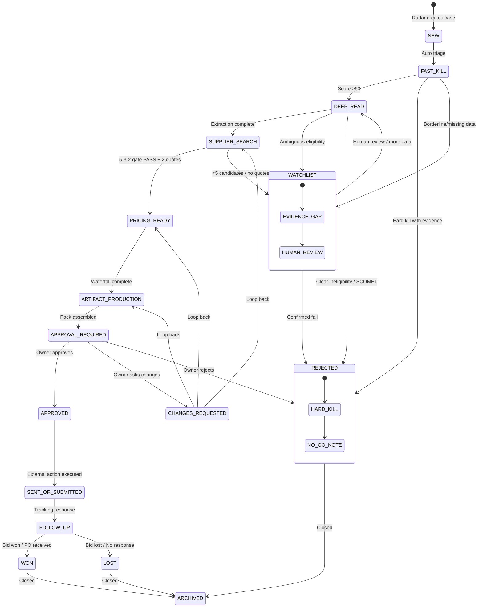

---

## Approval Boundaries (Non-Negotiable)

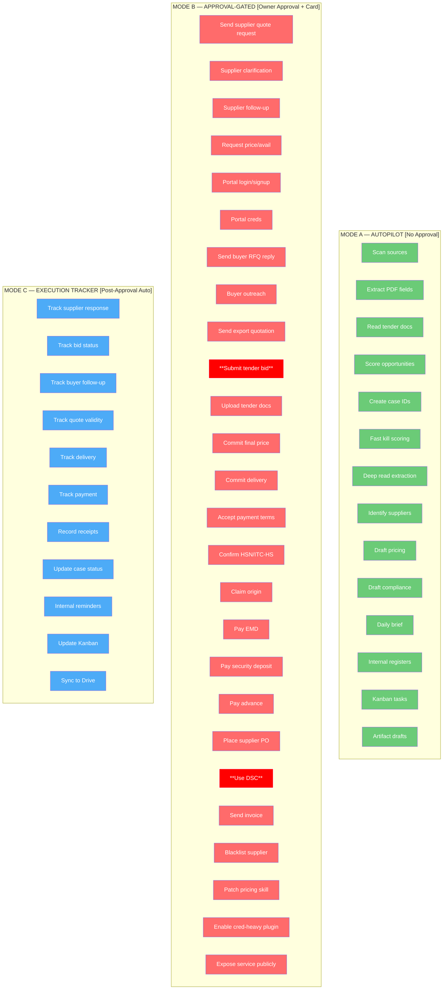

### Never Automated (Hard Blocks)
```
❌ Bid submission
❌ Tender portal upload
❌ DSC signing
❌ EMD/security payment
❌ Buyer quotation sending
❌ Supplier PO placement
❌ Supplier/buyer external outreach without approval
❌ Final price or delivery commitment
❌ Final HSN/ITC-HS classification
❌ Country-of-origin claim
❌ Legal/tax/compliance certification
❌ CAPTCHA/OTP/MFA/paywall bypass
❌ Credential/session/cookie/token/DSC/bank storage in repo
```

---

## Scheduled Operating Rhythm (Hermes Cron)

```mermaid
gantt
    title Daily Operating Rhythm (IST)
    dateFormat HH:mm
    axisFormat %H:%M
    
    section Morning Pipeline
    Core Source Radar           :a1, 05:30, 8m
    Morning Opp Intelligence    :a2, 06:00, 3m
    Shadow Profile Probe        :a3, 06:50, 2m
    Production Readiness Gate   :a4, 07:05, 8m
    V5 Prediction Shadow        :a5, 07:15, 5m
    Capability Truth Audit      :a6, 07:20, 5m
    
    section Owner Interaction
    Morning Operator Brief      :crit, b1, 08:30, 20m
    Agentic Review Enqueue      :b2, 08:45, 2m
    
    section Midday
    Retender/Corrigenda Watch   :c1, 12:30, 10m
    Midday Opportunity Radar    :c2, 13:00, 60m
    
    section Afternoon/Evening
    Supplier Follow-up Review   :d1, 17:00, 30m
    Weekly Learning Review      :d2, Fri 18:00, 60m
    Weekly Learning Enqueue     :d3, Fri 18:30, 2m
    Evening Execution Close     :d4, 20:30, 30m
    
    section Continuous
    Buyer Reply Monitor         :active, e1, 09:00, 780m
    
    section Monthly
    Strategy Deep Research      :milestone, f1, Manual, 180m
```

### Cron Job Details

| Time (IST) | Job ID | Purpose | Runtime |
|------------|--------|---------|---------|
| 05:30 | `core_source_agent_browser_radar` | GeM/CPPP/UNGM via read-only agent-browser | `hermes_no_agent_script` |
| 06:00 | `morning_opportunity_intelligence_html` | Public intake, 5-3-2 pass, pricing drafts, HTML report | `hermes_no_agent_script` |
| 06:50 | `daily_shadow_profile_probe` | Local profile evidence checks | `hermes_no_agent_script` |
| 07:05 | `daily_production_readiness_gate` | Production-readiness gate + owner action packet | `hermes_no_agent_script` |
| 07:15 | `v5_demand_forecast_low_competition_shadow` | Demand forecast + low-competition intelligence | `hermes_no_agent_script` |
| 07:20 | `hermes_capability_truth_audit` | Configured vs observed capabilities | `hermes_no_agent_script` |
| 08:30 | `morning_operator_brief` | **Canonical control tower** | `hermes_default` |
| 08:45 | `morning_agentic_review_enqueue` | Kanban review card | `hermes_no_agent_script` |
| 09:00-21:59 (30m) | `buyer_reply_monitor` | Gmail plugin inbound classification | `hermes_no_agent_script` |
| 12:30 | `daily_retender_corrigenda_watch` | Retenders, corrigenda, BOQ changes | `hermes_no_agent_script` |
| 13:00 | `midday_opportunity_radar` | Canary-test live sources, evidence-only | `hermes_plus_codex_when_needed` |
| 17:00 | `supplier_followup_review` | Quotes, external inbox, blocked cases | `hermes_default` |
| 18:00 (Fri) | `weekly_learning_review` | Wins/losses, propose memory/skill updates | `hermes_plus_chatgpt_snapshot` |
| 18:30 (Fri) | `weekly_learning_enqueue` | Kanban review card | `hermes_no_agent_script` |
| 20:30 | `evening_execution_close` | Reconcile, blockers, tomorrow's action | `hermes_default` |

---

## MCP Server (Bounded Tool Gateway)

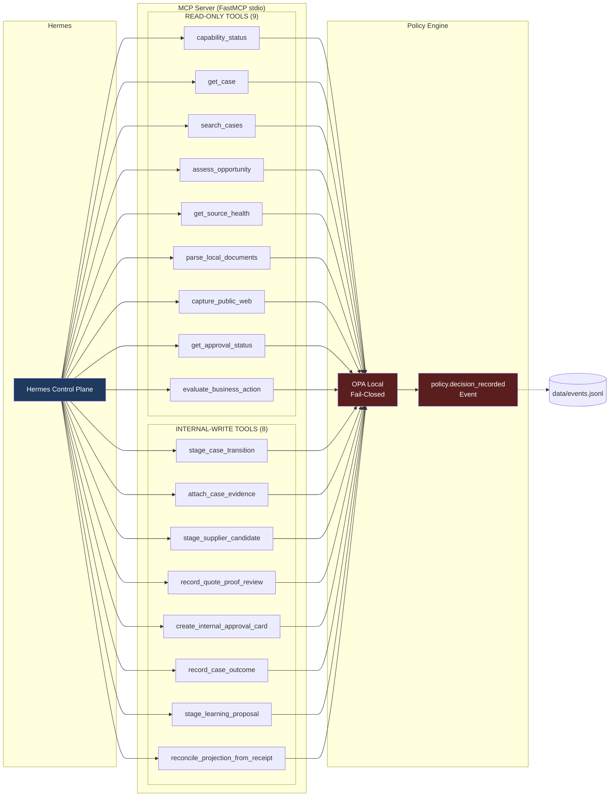

### Tool Categories

| Category | Tools | Policy |
|----------|-------|--------|
| **Read-Only** | `capability_status`, `get_case`, `search_cases`, `assess_opportunity`, `get_source_health`, `parse_local_documents`, `capture_public_web`, `get_approval_status`, `evaluate_business_action` | OPA checked, no state mutation |
| **Internal-Write** | `stage_case_transition`, `attach_case_evidence`, `stage_supplier_candidate`, `record_quote_proof_review`, `create_internal_approval_card`, `record_case_outcome`, `stage_learning_proposal`, `reconcile_projection_from_receipt` | OPA checked, receipt-backed, idempotent, no external execution |

**Critical:** No tool can send, submit, upload, pay, use DSC, commit price/delivery, finalize HSN/ITC-HS, or make origin/legal claims. OPA `allowed` ≠ execution tool.

---

## Buyer Acquisition Lane

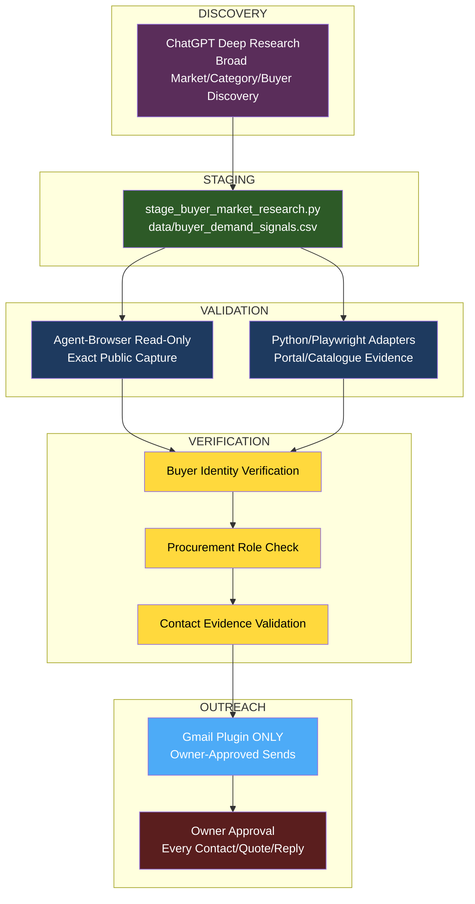

### Critical Rules
- Catalogue fit = hypothesis, not RFQ
- Never guess email or label general sales address as procurement
- Opt-outs/bounces/not-interested = auto-stop outreach
- No auto-reply
- **Gmail plugin only** — no gws, IMAP, Himalaya, or browser Gmail

---

## Prediction Contract (Forecasting)

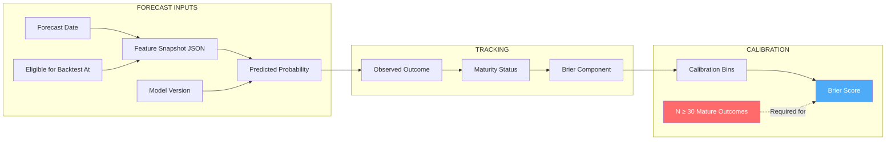

| Property | Value |
|----------|-------|
| `forecast_score` | Ranking score (NOT probability) |
| Current Model | `teos-expert-prior-v1` |
| Probability Status | `PRIOR_UNCALIBRATED` |
| Calibration Minimum | 30 mature outcomes |
| Required Tracking | forecast_date, eligible_for_backtest_at, feature_snapshot, predicted_probability, model_version, observed_outcome, maturity_status, brier_component |

**Until 30 mature outcomes:** Do not claim accuracy, precision, recall, or calibration. Research-only demand cannot receive high confidence. Pre-existing outcomes cannot be credited as forecast hits.

---

## Key Configuration Files

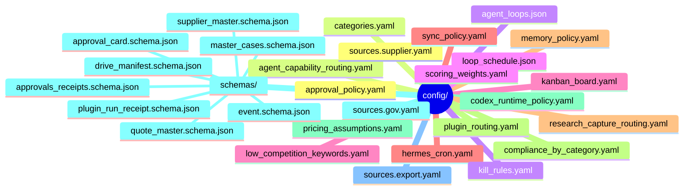

---

## Running the System

### Morning (5-10 min)
```bash
# 1. Review daily brief
open outputs/daily_briefs/brief_$(date +%Y%m%d).html

# 2. Check approval cards
ls receipts/approvals/

# 3. Approve via Hermes
# approve case GOV-20260630-001
```

### Health Checks
```bash
# System health
python3 scripts/system_health_check.py --runtime

# Schema validation
python3 scripts/validate_register_schemas.py

# Projection rebuild
python3 scripts/rebuild_projections_from_events.py

# Case readiness
python3 scripts/validate_case_readiness.py --all
```

### Manual Operations
```bash
# Run specific agents
python3 scripts/run_source_adapter.py --adapter mock
python3 scripts/generate_daily_brief.py
python3 scripts/score_opportunity.py --case_id GOV-20260630-001
python3 scripts/reconcile_hermes_kanban.py
```

### Low-Competition Radar
```bash
python3 scripts/low_competition_order_radar.py --dry-run
python3 scripts/retender_corrigenda_watch.py --dry-run
python3 scripts/buyer_repeat_purchase_analyzer.py --dry-run
python3 scripts/supplier_ready_category_matcher.py --dry-run
```

---

## Folder Structure

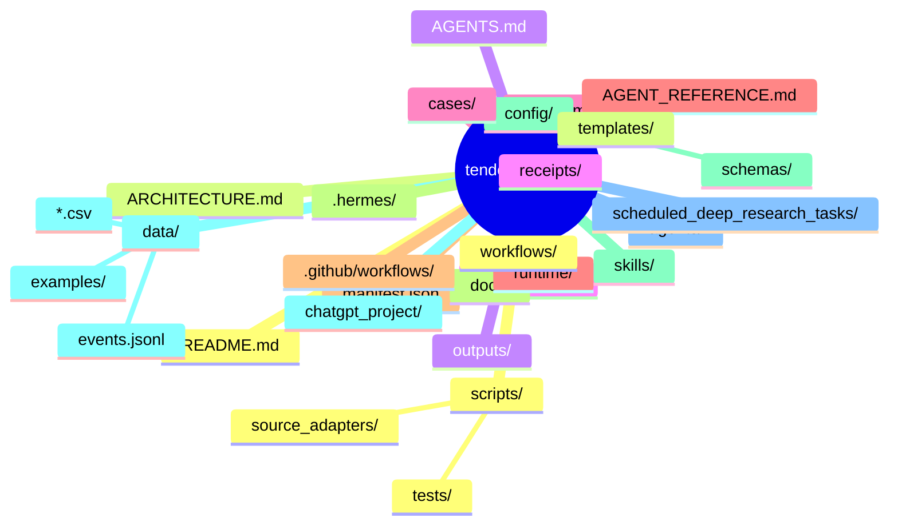

---

## GitHub Repository

- **Remote:** `origin/feat/teos-production-readiness-governance`
- **Branch:** `feat/teos-production-readiness-governance` (ahead 5, behind 8)
- **CI:** `.github/workflows/ci.yml` — runs `run_full_safe_regression.py --include-pytest`
- **Architecture Docs:** This file + `docs/` directory

---

## Version History

| Version | Date | Key Changes |
|---------|------|-------------|
| v4.1.2 | 2026-07-30 | Hybrid Research + Capture correction, Low-Competition Radar lane |
| v4.1.1 | 2026-07-12 | Max-capability upgrade: cron, Kanban, evidence bundles, task graphs |
| v4.1.0 | 2026-06-30 | Event-ledger hardening, Hermes-native control plane, Codex runtime |
| v3.1   | 2026-06-15 | Original runtime system |

---

*This architecture document is the single source of truth for Tender Export OS v4.1 system design. All agents, configs, and workflows derive from this specification.*