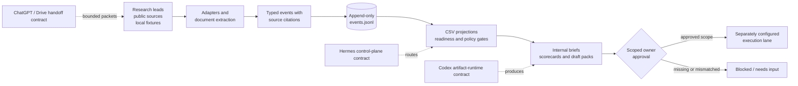

# Tender Export OS — Portfolio Case Study

> **Status:** public-template reference implementation. The evidence below covers local code, policies, fixtures, and tests—not a live tender operation or business outcome.

## Project Brief

Tender and export-RFQ work combines noisy source discovery, document extraction, supplier and pricing evidence, compliance uncertainty, deadlines, and actions that may create legal or financial commitments. Tender Export OS explores how to make that workflow traceable without treating an AI agent as an unchecked operator.

The project is organized around four engineering goals:

1. preserve provenance from source text to decision artifacts;
2. keep durable state replayable and auditable;
3. fail closed at external, financial, credential, legal, and compliance boundaries;
4. make useful local behavior reproducible with fixtures and tests.

The implemented pipeline is:

```text
Find → Fast Kill → Deep Read → Supplier Proof → Pricing Proof → Approval → Execution → Receipt
```

Government tenders and export RFQs share the state, evidence, and approval primitives while retaining separate pricing and compliance contracts.

## Architecture and Trust Boundaries



### 1. Evidence capture

Known-source adapters and document parsers produce structured records rather than untraceable prose. Extracted fields can retain source text and character spans. Quote evidence distinguishes supplier-specific proof from an indicative marketplace listing.

### 2. Canonical state and projections

[`scripts/event_ledger.py`](../scripts/event_ledger.py) builds and validates registered event types, assigns stream positions, and uses an exclusive file lock where the platform supports `fcntl`. The configured runtime path `data/events.jsonl` is the canonical local stream; the public template provides a sanitized [`events.example.jsonl`](../data/examples/events.example.jsonl). CSV registers and workboards are projections or working views. Projection rebuilding and integrity checks make drift visible instead of silently accepting it.

### 3. Governance before execution

Approval is a scoped data contract, not a phrase in a chat. Tests require the approval to match the case and action. Browser controls detect forbidden actions, and the bounded MCP surface intentionally offers no tool that sends, submits, uploads, pays, signs, or commits externally.

### 4. Integration roles without false equivalence

Hermes, Codex, ChatGPT, Google Drive, FastMCP, and OPA appear as designed integration roles and contracts. Their presence in configuration or documentation does not prove that a service is deployed, authenticated, available, or production-ready. The fixture-only path does not need those external systems.

## Representative Decision Trace

A locally reproducible path illustrates the design:

1. The mock adapter reads sanitized opportunity fixtures.
2. A scan returns structured opportunities and declares `external_side_effects: false`.
3. Start/completion events are validated against the event-type registry and appended to a temporary ledger.
4. Source-grounded extraction retains the value and its exact location in source text.
5. Readiness, pricing-proof, and approval checks can block insufficient evidence.
6. Internal artifacts may be generated for review.
7. An external action still requires an exact, receipt-backed approval scope through a separately configured lane.

This is deliberately different from claiming end-to-end autonomous bidding.

## Capability-to-Evidence Map

| Capability | Implementation | Verification | Bounded claim |
|---|---|---|---|
| Ordered event state | [`event_ledger.py`](../scripts/event_ledger.py), [`event_types.yaml`](../config/schemas/event_types.yaml) | [`test_event_ledger_concurrency.py`](../tests/test_event_ledger_concurrency.py), [`test_event_type_registry.py`](../tests/test_event_type_registry.py) | Concurrent local appends are unique and ordered in the tested environment |
| Rebuildable projections | [`rebuild_projections_from_events.py`](../scripts/rebuild_projections_from_events.py), [`check_projection_integrity.py`](../scripts/check_projection_integrity.py) | [`test_projection_integrity.py`](../tests/test_projection_integrity.py) | Tested drift and invalid-key cases are reported |
| Source-grounded extraction | [`extract_case_evidence.py`](../scripts/extract_case_evidence.py), [`quote_proof.py`](../scripts/quote_proof.py) | [`test_source_grounded_extraction.py`](../scripts/tests/test_source_grounded_extraction.py) | Fixture fields retain source spans; indicative listings do not become final-price proof |
| Safe adapter lifecycle | [`run_source_adapter.py`](../scripts/run_source_adapter.py), [`mock_adapter.py`](../scripts/source_adapters/mock_adapter.py) | [`test_run_source_adapter_cli.py`](../tests/test_run_source_adapter_cli.py) | Mock scans can run locally, emit events, and avoid case creation/external effects by default |
| Browser/action boundary | [`forbidden_action_guard.py`](../scripts/source_runtime/forbidden_action_guard.py), [`approval_guard.py`](../scripts/source_runtime/approval_guard.py) | [`test_forbidden_action_guard.py`](../tests/test_forbidden_action_guard.py), [`test_browser_blockers.py`](../tests/test_browser_blockers.py) | Tested submit/payment/DSC-style controls block rather than click through |
| Scoped owner decisions | [`process_owner_decision.py`](../scripts/process_owner_decision.py), [`approval_policy.yaml`](../config/approval_policy.yaml) | [`test_process_owner_decision.py`](../tests/test_process_owner_decision.py), [`test_business_effect_guard.py`](../tests/test_business_effect_guard.py) | Free-form owner text is insufficient; tested case/action mismatches fail closed |
| Bounded typed tool surface | [`tender_os_mcp_server.py`](../scripts/tender_os_mcp_server.py), [`tender_os_mcp_tools.py`](../scripts/tender_os_mcp_tools.py) | [`test_tender_os_mcp_tools.py`](../tests/test_tender_os_mcp_tools.py), [`test_tender_os_mcp_schemas.py`](../tests/test_tender_os_mcp_schemas.py) | Nine typed tools are exposed in tests, none for external execution |
| Proof-aware forecast shadowing | [`run_v5_forecast_shadow_harness.py`](../scripts/run_v5_forecast_shadow_harness.py) | [`test_v5_shadow_harness.py`](../tests/test_v5_shadow_harness.py) | Weak-evidence promotions/actions are measured or blocked; predictive accuracy is not claimed |
| Public-template hygiene | [`check_no_private_runtime_data.py`](../scripts/check_no_private_runtime_data.py), [`system_health_check.py`](../scripts/system_health_check.py) | [`test_no_private_data_committed.py`](../tests/test_no_private_data_committed.py), [`test_safe_regression_runner.py`](../tests/test_safe_regression_runner.py) | The declared public surface and sanitized examples pass the repository's local checks |

## Reproducible Local Demonstration

### Prerequisite

Python 3.12 was used for the verification snapshot. No portal, Google, messaging, payment, or signing credentials are needed for this demo.

```bash
python3 -m venv .venv
.venv/bin/python -m pip install -r requirements.lock.txt
```

### Run a mock scan into a temporary directory

```bash
demo_dir="$(mktemp -d)"
TENDER_OS_EVENTS_FILE="$demo_dir/events.jsonl" \
  .venv/bin/python scripts/run_source_adapter.py \
  --adapter mock --mode scan --limit 2 \
  --output "$demo_dir/scan.json" --record-event

.venv/bin/python -m json.tool "$demo_dir/scan.json"
cat "$demo_dir/events.jsonl"
```

The verified run produced two mock opportunities, reported `create_cases: false` and `external_side_effects: false`, and wrote `source_adapter.scan_started` plus `source_adapter.scan_completed` to the temporary ledger. Counts depend on the fixture and command limit; the safety fields are the important contract.

### Run high-signal tests

```bash
.venv/bin/python -m pytest -q \
  tests/test_event_ledger_concurrency.py \
  tests/test_projection_integrity.py \
  scripts/tests/test_source_grounded_extraction.py \
  tests/test_process_owner_decision.py \
  tests/test_forbidden_action_guard.py \
  tests/test_run_source_adapter_cli.py \
  tests/test_tender_os_mcp_tools.py
```

### Run public-template checks and the complete suite

```bash
.venv/bin/python scripts/check_no_private_runtime_data.py --public-template
.venv/bin/python scripts/system_health_check.py --public-template
.venv/bin/python -m pytest -q
```

## Verification Snapshot

Point-in-time results from this worktree on 2026-08-07:

| Check | Result |
|---|---|
| `.venv/bin/python --version` | Python 3.12.13 |
| `.venv/bin/python -m pytest --version` | pytest 9.1.1 |
| `.venv/bin/python -m pytest -q` | 719 passed |
| `check_no_private_runtime_data.py --public-template` | Passed |
| `system_health_check.py --public-template` | 8 checks passed |

Runtime is machine-dependent and is not presented as a performance benchmark.

## Evidence-Backed Portfolio Summary

- Designed a governed tender/RFQ decision pipeline that separates broad research, deterministic evidence capture, internal artifacts, scoped approvals, and external execution.
- Implemented an append-only, registered-event state model with ordered writes, projection rebuilds, drift checks, and receipt-oriented decision history.
- Built source-grounded extraction and quote-proof contracts that preserve field-level provenance and prevent indicative listings from becoming final-price evidence.
- Added fail-closed approval, browser, credential, and tool-surface boundaries so local automation can prepare work without silently authorizing business effects.
- Validated the public-template implementation with 719 passing local tests plus privacy and system-health checks at the recorded snapshot.

## Honest Non-Claims

This portfolio evidence does not claim:

- a live or continuously running Hermes, Codex, ChatGPT, Drive, FastMCP, or OPA deployment;
- reliable access to GeM, CPPP, eProcure, supplier, buyer, or foreign-government portals;
- bypass of CAPTCHA, OTP, authentication, payment, DSC, upload, or submission controls;
- legal, tax, HSN/ITC-HS, country-of-origin, eligibility, pricing, or delivery correctness;
- calibrated forecast accuracy, production SLOs, bid wins, revenue, cost savings, or user adoption;
- that fixture-backed tests substitute for live canaries, security review, operator acceptance, or regulated-domain expert review.

The strongest supported claim is narrower: this repository contains a substantial, locally testable reference implementation of provenance-aware workflow automation and approval-gated agent tooling.

## Three-Minute Reviewer Path

1. Read the [README architecture and evidence boundary](../README.md#architecture-at-a-glance).
2. Inspect [`event_ledger.py`](../scripts/event_ledger.py) and its [concurrency test](../tests/test_event_ledger_concurrency.py).
3. Inspect the [source-grounded extraction test](../scripts/tests/test_source_grounded_extraction.py).
4. Inspect the [scoped approval test](../tests/test_process_owner_decision.py) and [bounded MCP test](../tests/test_tender_os_mcp_tools.py).
5. Run the mock scan and focused tests above; no live service is required.
