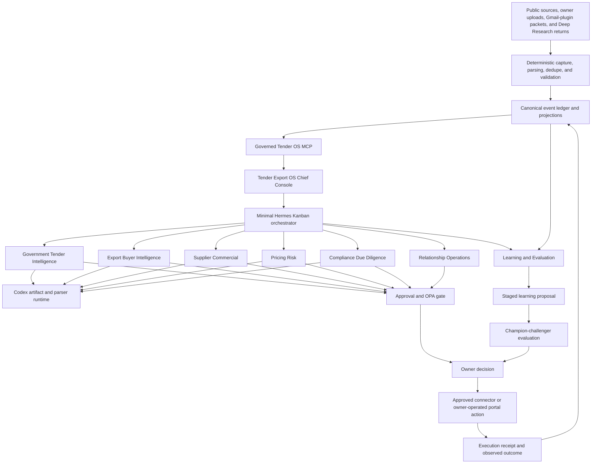

# Introduction

This plan upgrades the existing Tender Export OS without replacing its proven foundations. The target is a living commercial operating system that performs most sensing, evidence capture, research, triage, drafting, tracking, follow-up preparation, exception detection, and learning work while preserving explicit owner authority for every external, financial, legal, DSC, price, classification, origin, delivery, payment-term, supplier-commitment, and submission action.

The architecture is Hermes-native:

- one owner-facing `tender-export-os` profile remains the Chief Operating Console;
- one minimal `teos-orchestrator` profile performs headless Kanban decomposition and routing;
- seven durable specialist profiles receive role-specific memory, skills, MCP tools, budgets, and evaluations;
- `delegate_task` is used only for short, synchronous reasoning subtasks;
- Hermes Kanban is used for durable cross-profile work and human approval waits;
- deterministic Python/Playwright jobs continue to own exact capture, parsing, dedupe, calculations, projections, receipts, and validations;
- Codex App-Server Runtime continues to own artifact-heavy file, workbook, PDF, document, presentation, parser, and test work;
- `data/events.jsonl` remains the canonical append-only state stream;
- ChatGPT Deep Research remains the broad discovery and strategy layer, with all returns staged and evidenced before operational use.

## Verified baseline on 2026-07-12

| Surface | Verified baseline | Upgrade implication |
|---|---|---|
| Hermes profiles | Only `tender-export-os` is a real Tender OS profile. Ten specialist commands are wrappers that launch the same profile. | Create real profiles and remove alias names from Kanban assignments. |
| Kanban | Board exists and is healthy, but current cards are assigned only to `tender-export-os`. | Migrate to real profile lanes and validate every assignee before task creation. |
| Cron | Nine enabled jobs run as deterministic no-agent scripts in the live scheduler. | Keep deterministic capture jobs; add idempotent Kanban enqueuers for judgment-heavy reviews. |
| Tender OS MCP | Nine allowlisted tools with OPA enforcement are live. A cold discovery run took approximately 11 seconds while Hermes defaults to a 1.5-second discovery wait. | Set `mcp_discovery_timeout: 20`, test cold/warm discovery, and scope MCP tools per profile. |
| Memory | Profile-local `memories/MEMORY.md` and `memories/USER.md` exist; recovered Ares context is separate and read-only. | Preserve live memory, create role memory boundaries, and do not merge raw recovered history. |
| Behavioral safety | Latest repeated evaluation passed 27/27 attempts. | Extend the evaluator to every specialist profile and keep 100% critical-scenario pass rate. |
| Repository validation | Current public-template privacy scan, system health, event registry, and register schemas pass. The canonical full-safe-regression JSON is stale and still reports an older failure. | Regenerate one current canonical baseline before migration. |
| Commercial data | 18 cases, 169 forecast candidates, 249 backtest rows, 0 mature forecast outcomes, 6 quote rows, 0 strict supplier quote proofs, 3 sent introductions, and 0 inbound replies. | Prioritize outcome and evidence collection before advanced ML or wider autonomy. |
| Forecasting | `teos-expert-prior-v1` is explicitly `PRIOR_UNCALIBRATED`. | Separate targets and models only after per-target maturity gates are met. |

## Target architecture

## Target persistent profile roster

| Profile | Durable responsibility | Enabled toolsets | Tender OS MCP tools | Explicitly unavailable |
|---|---|---|---|---|
| `tender-export-os` | Owner console, chief operator, approvals, final routing, owner brief | Existing console set; policy-constrained | All nine bounded tools | Direct Gmail/browser Gmail, bid submission, payment, DSC, final commitments |
| `teos-orchestrator` | Decompose top-level goals and route Kanban children | `kanban`, `todo`, `skills` | `capability_status` only | `terminal`, `file`, `code_execution`, `web`, `browser`, `computer_use`, external messaging |
| `gov-tender-intelligence` | GOV discovery, fast-kill review, tender deep read, corrigenda and repeat-buyer intelligence | `web`, `browser`, `file`, `terminal`, `skills`, `memory`, `delegation`, `todo` | `get_case`, `search_cases`, `assess_opportunity`, `get_source_health`, `parse_local_documents`, `capture_public_web` | Email, submissions, uploads, payments, DSC |
| `export-buyer-intelligence` | Market/category research, buyer verification, public RFQ evidence, demand hypotheses | `web`, `browser`, `file`, `terminal`, `skills`, `memory`, `delegation`, `todo` | `get_case`, `search_cases`, `assess_opportunity`, `get_source_health`, `parse_local_documents`, `capture_public_web` | Email send, quote commitments, final classification/origin |
| `supplier-commercial` | Supplier 5-3-2, supplier verification, quote-proof readiness, response quality | `web`, `browser`, `file`, `skills`, `memory`, `delegation`, `todo` | `get_case`, `search_cases`, `parse_local_documents`, `capture_public_web`, `get_approval_status` | Supplier contact, PO, payment, volume or delivery commitment |
| `pricing-risk` | Cost waterfalls, working-capital exposure, L1 sensitivity, margin and scenario analysis | `file`, `terminal`, `code_execution`, `skills`, `memory`, `todo` | `get_case`, `search_cases`, `parse_local_documents`, `get_approval_status` | Final price, payment-term acceptance, buyer/supplier contact |
| `compliance-due-diligence` | Draft-only eligibility, DGFT/SCOMET, candidate classification, origin and Incoterms review | `web`, `browser`, `file`, `skills`, `memory`, `todo` | `get_case`, `search_cases`, `parse_local_documents`, `capture_public_web`, `get_approval_status` | Final legal/compliance/classification/origin claims |
| `relationship-ops` | Approved communication packet preparation, reply classification, opt-outs, follow-up timing | `file`, `skills`, `memory`, `session_search`, `todo` | `get_case`, `search_cases`, `get_approval_status`, `evaluate_business_action` | Direct email tool, browser Gmail, automatic reply, commercial commitments |
| `learning-evaluation` | Outcome review, source/supplier performance, model/skill/memory proposals, regression analysis | `file`, `terminal`, `code_execution`, `skills`, `memory`, `session_search`, `todo` | `capability_status`, `get_case`, `search_cases`, `get_source_health`, `get_approval_status` | External tools, policy mutation, unapproved memory/skill/model promotion |

Profiles other than `tender-export-os` do not run separate gateways or maintain independent cron schedules. The existing `tender-export-os` gateway hosts the Kanban dispatcher and spawns worker processes only when assigned cards become ready.

## Program success measures

| Metric | Initial target | Measurement source |
|---|---:|---|
| Internal workflow automation coverage | At least 90% of eligible internal steps after the 30-day pilot | Kanban runs plus `data/agent_run_log.csv` |
| External effects with valid approval and connector receipt | 100% | `data/approvals_receipts.csv`, policy receipts, submission/send receipts |
| Critical behavioral scenarios passed | 100% across three repeats per profile | `data/agent_evaluations.csv` and evaluation reports |
| Kanban tasks assigned to known profiles or registered external lanes | 100% | profile validator and Kanban assignee audit |
| Closed cases with explicit outcome evidence | 100% after rollout | `data/case_outcomes.csv` |
| Strict quote proof before pricing-ready | 100% | `data/quote_master.csv` plus readiness validator |
| Owner-facing operational load | Median no more than 20 minutes/day during pilot | owner brief decision receipts |
| Duplicate external sends/submissions | 0 | idempotency keys and connector receipts |
| Forecasts described as calibrated before target-specific maturity gate | 0 | forecast/model registry validator |

## 1. Requirements & Constraints

- **REQ-001**: Preserve `data/events.jsonl` as the canonical append-only state stream. CSVs, Kanban, Drive, dashboards, memories, and reports remain projections or bounded working views.
- **REQ-002**: Use `case_id` as the primary key for every tender, export, supplier, pricing, compliance, approval, execution, outcome, and learning object.
- **REQ-003**: Replace Tender specialist command aliases with real Hermes profiles or explicitly registered non-Hermes worker lanes before assigning durable Kanban tasks to those names.
- **REQ-004**: Keep deterministic collection, parsing, dedupe, calculations, schema validation, projections, idempotency, receipts, and policy decisions outside the LLM loop.
- **REQ-005**: Use Hermes profiles only for role-specific judgment that benefits from durable identity, memory, evaluation history, and Kanban accountability.
- **REQ-006**: Use `delegate_task` only for bounded reasoning needed by the current parent run. Do not use it for approval waits, long-running work, durable handoffs, or cross-profile state.
- **REQ-007**: Support complete GOV progression from source signal through award/delivery/payment outcome capture, without enabling autonomous portal submission or DSC use.
- **REQ-008**: Support complete EXPORT progression from market/buyer signal through approved outreach, reply, RFQ, quote, order, shipment, invoice, payment, and repeat-buyer outcome capture.
- **REQ-009**: Record economically meaningful outcomes before training or promoting advanced forecast models.
- **REQ-010**: Separate GOV and EXPORT forecast targets, horizons, feature sets, labels, evaluations, and model versions.
- **REQ-011**: Route unknown-market discovery to ChatGPT Deep Research and exact known-source capture to Python/Playwright/agent-browser.
- **REQ-012**: Use Codex App-Server Runtime for artifact-heavy work and store a plugin/runtime receipt for every produced pack or executable artifact.
- **REQ-013**: Make every agent run produce a structured completion, blocker, or approval handoff with cited sources, output paths, and one next action.
- **REQ-014**: Preserve current recovery context as read-only and reverify any historical claim against current ledgers and evidence before use.
- **REQ-015**: Keep the existing nine deterministic scheduled jobs unless a measured failure or duplicated function justifies retirement.
- **REQ-016**: Add agentic reviews through idempotent Kanban task creation instead of creating one always-on gateway per specialist profile.
- **REQ-017**: Keep owner briefs exception-first and cap the recommended owner action list at three, with one primary action.
- **SEC-001**: No external send, bid submission, portal upload, payment, EMD, security, advance, DSC action, final price, delivery commitment, payment-term acceptance, final HSN/ITC-HS, origin claim, compliance declaration, PO, or permanent supplier blacklist may occur without an exact-scope owner receipt and post-action connector receipt.
- **SEC-002**: Do not copy `.env`, `auth.json`, cookies, browser profiles, session tokens, or connector credentials from `tender-export-os` into specialist profiles automatically.
- **SEC-003**: Provision each specialist with a minimum toolset and an explicit MCP tool include list. An omitted tool is unavailable.
- **SEC-004**: Treat webpages, documents, emails, recovered context, tool output, and delegated responses as untrusted data. Retain prompt-injection checks and evidence provenance.
- **SEC-005**: Use the Gmail plugin contract for every Gmail operation. Hermes profiles may prepare and inspect packets but do not receive browser Gmail, IMAP, `gws`, or Himalaya access.
- **SEC-006**: Public web capture obeys robots rules, rate limits, HTTPS restrictions, source allowlists, CAPTCHA/login/paywall stops, and bounded crawl limits.
- **SEC-007**: Every external action must use an idempotency key derived from `case_id`, action type, target, content/scope hash, and approval receipt.
- **SEC-008**: Raw tender/RFQ documents, supplier tables, buyer email bodies, credentials, bank details, DSC material, and private portal content must not enter durable Hermes memory.
- **SEC-009**: Agent-created memory, skill, model, routing-weight, compliance-rule, and pricing-rule changes remain proposals until owner-approved evaluation and rollback evidence exist.
- **CON-001**: Hermes Kanban remains single-host. Multi-host orchestration is out of scope until a separately approved queue architecture exists.
- **CON-002**: SQLite/CSV/event-ledger storage remains the default while current volume is small and rebuildable.
- **CON-003**: Temporal, PostgreSQL/pgvector, Langfuse, Firecrawl, cloud browser infrastructure, external memory, and RL are not default dependencies.
- **CON-004**: Profile migration must preserve the running `tender-export-os` gateway and unrelated `freshos` and `brained` profiles.
- **CON-005**: The existing dirty worktree and user-created audit file must be preserved; implementation must not reset or discard unrelated work.
- **GUD-001**: Prefer a deterministic rule or typed state transition over an agent whenever the same input must produce the same output.
- **GUD-002**: Prefer an on-demand delegate over a new profile when the work does not need durable memory, an independent queue, or a repeated professional identity.
- **GUD-003**: Store case truth in the event ledger, not in profile memories.
- **GUD-004**: Store role heuristics, owner corrections, and verified repeated patterns in profile memory only after promotion.
- **GUD-005**: Use the existing repository virtual environment for Python execution.
- **PAT-001**: Follow `Sense -> Verify -> Remember -> Reason -> Draft -> Gate -> Execute through approved connector -> Observe -> Learn -> Propose -> Test -> Approve -> Promote`.
- **PAT-002**: Use an executor-critic-reviser loop for deep read, supplier proof, pricing, compliance, and pack quality; cap revisions at two before blocking for review.
- **PAT-003**: Use idempotent Kanban keys in the form `teos:<case_id>:<stage>:<version>`.
- **PAT-004**: Every profile configuration change requires a profile export, configuration check, focused evaluation, and rollback path.

## 2. Implementation Steps

### Implementation Phase 0 — Establish a green, reproducible baseline

- GOAL-001: Produce a current, rollback-safe baseline before any live Hermes profile or Kanban routing mutation. Target window: days 0–2.

| Task | Description | Completed | Date |
|------|-------------|-----------|------|
| TASK-001 | Export `tender-export-os` with `hermes profile export tender-export-os -o outputs/upgrade_baseline/tender-export-os-before-specialists.tar.gz`; hash the archive and record the current Hermes commit, profile list, profile descriptions, gateway PID, cron list, Kanban board list, MCP list, skills summary, and memory status in `outputs/upgrade_baseline/baseline.json`. | ✅ | 2026-07-12 |
| TASK-002 | Add `scripts/capture_upgrade_baseline.py` with `capture_profiles()`, `capture_kanban()`, `capture_cron()`, `capture_mcp()`, `capture_data_counts()`, and `write_report()`; default to read-only inspection and redact secret-bearing fields. Add `tests/test_capture_upgrade_baseline.py`. | ✅ | 2026-07-12 |
| TASK-003 | Regenerate `outputs/regression/full_safe_regression_report.json` with `.venv/bin/python scripts/run_full_safe_regression.py --output outputs/regression/full_safe_regression_report.json`; require PASS and archive the stale `outputs/full_safe_regression_audit_latest.json` as historical rather than treating it as current truth. | ✅ | 2026-07-12 |
| TASK-004 | Add top-level `mcp_discovery_timeout: 20` to `/Users/raghav/.hermes/profiles/tender-export-os/config.yaml` and mirror it in `config/hermes_profile_capabilities.yaml`; run three cold MCP starts and ten warm agent starts, requiring all nine Tender OS tools to appear on every run. Store timings in `outputs/upgrade_baseline/mcp_discovery_reliability.json`. Depends on TASK-001. | ✅ | 2026-07-12 |
| TASK-005 | Correct stale statements in `HERMES_TENDER_EXPORT_OS_AUDIT_AND_MAXIMUM_CAPABILITY_VISION_20260712.md`, `docs/HERMES_NATIVE_MAX_CAPABILITY_SETUP.md`, and `docs/HERMES_LAST_PASS_IMPROVEMENT_AUDIT_20260712.md`: memory files exist, specialist names are aliases rather than profiles, the canonical safe-regression report is stale, and MCP cold discovery requires a longer wait. | ✅ | 2026-07-12 |
| TASK-006 | Run `.venv/bin/python scripts/validate_agent_loops.py`, `validate_loop_schedule.py`, `validate_register_schemas.py`, `validate_event_type_registry.py`, `check_projection_integrity.py --fail-on-drift`, `evaluate_hermes_behavioral_contracts.py --validate-only`, `tender_os_policy.py --self-test`, and the focused pytest suite. Save exact command results in `outputs/upgrade_baseline/validation.json`. | ✅ | 2026-07-12 |

Completion criteria:

- Current full safe regression is PASS.
- Projection drift is zero.
- Tender MCP discovery succeeds on 3/3 cold and 10/10 warm trials.
- Profile export and SHA-256 receipt exist.
- No live profile, cron job, Kanban card, external connector, or business register has been mutated except the approved MCP timeout setting.

### Implementation Phase 1 — Create the real Hermes specialist fleet

- GOAL-002: Replace alias-based personas with real, least-privilege, on-demand Hermes profiles. Target window: days 3–10. Depends on GOAL-001.

| Task | Description | Completed | Date |
|------|-------------|-----------|------|
| TASK-007 | Create `config/hermes_specialist_profiles.yaml` containing the nine-profile roster in this plan, profile descriptions, allowed toolsets, Tender MCP include lists, skill bundles, memory scope, max turns, task timeout, delegate limits, stop conditions, output contract, and evaluation scenarios. | ✅ | 2026-07-12 |
| TASK-008 | Create profile config overlays under `config/hermes_profiles/<profile>.yaml` for `teos-orchestrator`, `gov-tender-intelligence`, `export-buyer-intelligence`, `supplier-commercial`, `pricing-risk`, `compliance-due-diligence`, `relationship-ops`, and `learning-evaluation`. Do not store credentials or absolute secret paths. | ✅ | 2026-07-12 |
| TASK-009 | Refactor `scripts/apply_specialist_profile_souls.py` so `PROFILE_SPECS` is loaded from `config/hermes_specialist_profiles.yaml`; retain dry-run default, backup behavior, unique-prompt canaries, and global approval gates. Add migration coverage to `tests/test_profile_specialization.py`. | ✅ | 2026-07-12 |
| TASK-010 | Add `scripts/provision_hermes_specialist_profiles.py` with `load_registry()`, `build_create_commands()`, `write_profile_overlay()`, `install_role_skills()`, and `provision()`. Default to dry-run. In `--apply` mode call `hermes profile create <name> --no-skills --description <description>` only for missing profiles; never use `--clone-all` and never copy `.env`, `auth.json`, memory, cron, or gateway state. | ✅ | 2026-07-12 |
| TASK-011 | Provision the eight new profiles from TASK-010. Configure model/provider through the supported Hermes setup flow per profile; stop and emit `AUTH_REQUIRED` when interactive OpenAI Codex authentication is missing. Verify with `hermes auth status openai-codex` and store only pass/fail metadata, never tokens. | ✅ | 2026-07-12 |
| TASK-012 | Configure each profile's `platform_toolsets.cli` and `mcp_servers.tender_os.tools.include` exactly as listed in the target roster. Set `mcp_discovery_timeout: 20`, `terminal.cwd` to the repo, `kanban.dispatch_in_gateway: false`, and no cron jobs/gateway service for specialist profiles. | ✅ | 2026-07-12 |
| TASK-013 | Update `config/worker_plugin_policy.yaml` to target the new profile names and split the existing `pricing-compliance` imports between `pricing-risk` and `compliance-due-diligence`. Keep all imported skills profile-local and `teos_external_actions_allowed: false`. | ✅ | 2026-07-12 |
| TASK-014 | Run `scripts/import_external_worker_skills.py --write` only for the new specialist profiles, then run `scripts/validate_worker_plugin_imports.py`. Do not enable credential-heavy Hermes plugins, third-party MCPs, messaging plugins, or browser cloud services. | ✅ | 2026-07-12 |
| TASK-015 | Create `scripts/validate_specialist_profiles.py` with checks for on-disk profile existence, unique descriptions/SOUL files, auth status, exact toolsets, MCP allowlist, no profile-local cron, no separate gateway, terminal workspace, forbidden tool absence, role skill presence, and no copied memory/auth material. Add `tests/test_validate_specialist_profiles.py`. | ✅ | 2026-07-12 |
| TASK-016 | Update `config/kanban_board.yaml`, `docs/HERMES_KANBAN_BOARD.md`, `scripts/create_case_task_graph.py`, `scripts/reconcile_hermes_kanban.py`, `scripts/kanban_blocked_task_drain.py`, fixtures, and tests to use real profile names. Split pricing and compliance tasks. Set `teos-orchestrator` as the only decomposition profile and `tender-export-os` as the owner-facing approval profile. | ✅ | 2026-07-12 |
| TASK-017 | Preserve old shell commands as 30-day compatibility wrappers only. Each wrapper must print its target profile and deprecation notice. Remove all compatibility alias names from Kanban assignee configuration and validate that no task graph can assign to a wrapper-only name. | ✅ | 2026-07-12 |
| TASK-018 | Create one side-effect-free Kanban canary per new profile using `workspace=dir:/Users/raghav/Downloads/tender_export_os_v3_1_runtime_system`, a role-specific read-only task, and idempotency key `teos:profile-canary:<profile>:v1`. Require structured completion, cited local evidence, and zero external actions. | ✅ | 2026-07-12 |

Completion criteria:

- `hermes profile list` shows all nine Tender profiles on disk.
- `hermes kanban --board tender-export-os assignees --json` reports the real profiles as `on_disk: true`.
- Specialist validation passes with zero forbidden tools, copied secrets, duplicate SOUL hashes, profile-local cron jobs, or extra gateways.
- All eight specialist canaries complete successfully.
- Existing `freshos`, `brained`, and the running `tender-export-os` gateway remain unchanged and healthy.

### Implementation Phase 2 — Make Kanban the durable case graph

- GOAL-003: Convert hard-coded task templates into a validated, idempotent, evidence-aware case graph that survives restarts and approval waits. Target window: days 8–16. Depends on GOAL-002.

| Task | Description | Completed | Date |
|------|-------------|-----------|------|
| TASK-019 | Create `config/case_task_graph.yaml` with separate GOV and EXPORT DAGs, profile assignees, parent dependencies, required inputs, expected outputs, approval boundary, retry limit, max runtime, completion validator, and idempotency-key template for every stage. | ✅ | 2026-07-12 |
| TASK-020 | Refactor `scripts/create_case_task_graph.py` to load `config/case_task_graph.yaml` through `load_graph_spec()`, validate assignees against live profiles before creation, and fail before any board write when a profile or parent key is unknown. | ✅ | 2026-07-12 |
| TASK-021 | Add typed handoff fields to every task body: `case_id`, `workflow_type`, `stage`, `source_event_ids`, `input_artifacts`, `required_output_schema`, `approval_required`, `deadline`, `stop_conditions`, and `next_profile`. | ✅ | 2026-07-12 |
| TASK-022 | Add `scripts/validate_kanban_handoff.py` with `validate_task_input()`, `validate_completion()`, and `validate_parent_results()`. A worker may complete only when required files exist, citations are present, run-log evidence exists, and the stage-specific validator passes. | ✅ | 2026-07-12 |
| TASK-023 | Use typed `needs_input` blocking for owner approvals, missing documents, unavailable credentials, ambiguous legal/compliance facts, and portal human challenges. Add tests proving approval-blocked tasks do not auto-promote. | ✅ | 2026-07-12 |
| TASK-024 | Extend `scripts/reconcile_hermes_kanban.py` to read the live board directly through `hermes kanban --board tender-export-os list --json`, compare it with event-ledger projections, and emit a plan before any `--apply`. Preserve idempotency and never rewrite completed task history. | ✅ | 2026-07-12 |
| TASK-025 | Add recovery rules for stale, crashed, duplicate, orphaned, and unknown-assignee tasks. Reclaim only when the worker PID is gone or stale timeout is exceeded; auto-block after the configured failure limit; never retry an external-effect task without a new owner command. | ✅ | 2026-07-12 |
| TASK-026 | Shadow-run complete task graphs for three GOV and three EXPORT cases selected from existing rows without performing external actions. Store graph receipts under `outputs/kanban_task_graphs/shadow/<case_id>/`. | ✅ | 2026-07-12 |

Completion criteria:

- Every generated assignee exists or is an explicitly registered external worker lane.
- Re-running graph creation produces zero duplicate tasks.
- All six shadow graphs reach a truthful completion or typed blocker.
- No approval-blocked card auto-promotes.
- Parent results and artifact paths are visible to downstream workers.

### Implementation Phase 3 — Add explicit business outcomes and a learning-grade event model

- GOAL-004: Record observed business reality directly instead of inferring outcomes from narrative notes or case status. Target window: days 12–24. Depends on GOAL-001; may proceed in parallel with GOAL-003 schema work.

| Task | Description | Completed | Date |
|------|-------------|-----------|------|
| TASK-027 | Add event types and object types for `source.adapter_degraded`, `tender.deadline_changed`, `case.fast_kill_completed`, `supplier.candidate_verified`, `supplier.quote_received`, `supplier.quote_rejected`, `buyer.reply_received`, `buyer.opted_out`, `buyer.rfq_verified`, `approval.expired`, `execution.receipt_ingested`, `case.outcome_recorded`, `payment.received`, `forecast.matured`, `learning.proposal_staged`, `learning.proposal_evaluated`, and `learning.promoted` in `config/schemas/event_types.yaml` and `config/schemas/event.schema.json`. | ✅ | 2026-07-12 |
| TASK-028 | Create `config/schemas/case_outcomes.schema.json`, `data/case_outcomes.csv`, and sanitized example files. Required columns: `outcome_id`, `case_id`, `workflow_type`, `outcome_type`, `outcome_value`, `occurred_at`, `evidence_path`, `evidence_sha256`, `verification_status`, `recorded_by`, `recorded_at`, `supersedes_outcome_id`, and `notes`. | ✅ | 2026-07-12 |
| TASK-029 | Create `config/schemas/learning_proposals.schema.json` and `data/learning_proposals.csv` with proposal target, evidence event IDs, affected workflows, current/proposed version, fixtures, evaluation report, rollback artifact, status, approval ID, and application timestamp. | ✅ | 2026-07-12 |
| TASK-030 | Create `config/schemas/model_registry.schema.json` and `data/model_registry.csv` with target, workflow, horizon, model version, feature-schema hash, training/evaluation windows, mature sample, class counts, metrics, calibration status, status, artifact path, approval ID, and rollback version. | ✅ | 2026-07-12 |
| TASK-031 | Create `config/schemas/agent_evaluations.schema.json` and `data/agent_evaluations.csv` with profile, scenario, case/run ID, repeat, expected result, actual result, evidence completeness, policy compliance, latency, token/cost metadata when available, score, status, and report path. | ✅ | 2026-07-12 |
| TASK-032 | Add `scripts/record_case_outcome.py` with `validate_evidence()`, `build_outcome_event()`, `append_outcome()`, and `supersede_outcome()`. Default to dry-run. Require an existing case, allowed outcome type, occurred-at timestamp, evidence path/hash, and explicit verification status. | ✅ | 2026-07-12 |
| TASK-033 | Extend `scripts/rebuild_projections_from_events.py`, `scripts/initialize_event_ledger.py`, and `scripts/validate_register_schemas.py` to rebuild and validate the four new registers. Add backward-compatible handling for historical events without outcome objects. | ✅ | 2026-07-12 |
| TASK-034 | Add `scripts/validate_business_state_consistency.py` to reject `SENT_OR_SUBMITTED` without receipt, `PRICING_READY` without two strict quotes, `PAYMENT_RECEIVED` without payment evidence, closed cases without outcome evidence, conflicting sent/not-sent claims, and approvals left pending after a verified external receipt. | ✅ | 2026-07-12 |
| TASK-035 | Change `scripts/backtest_v5_demand_forecasts.py` to label mature observations from `data/case_outcomes.csv` and event timing, not from current case status alone. Preserve time separation and exclude outcomes that predate the forecast. | ✅ | 2026-07-12 |

Completion criteria:

- Event registry, all register schemas, and projection integrity pass.
- No new case can be marked WON, LOST, ARCHIVED-after-action, or PAYMENT_RECEIVED without explicit outcome evidence.
- Forecast backtests use only time-separated, verified outcomes.
- Historical cases remain readable without fabricated outcome rows.

### Implementation Phase 4 — Strengthen sensing, source capture, and market research

- GOAL-005: Create a reliable multi-tier sensing system for government sources, export demand, buyer discovery, suppliers, historical awards, corrigenda, and source health. Target window: days 18–32. Depends on GOAL-004 event types.

| Task | Description | Completed | Date |
|------|-------------|-----------|------|
| TASK-036 | Add `scripts/research_route.py` with `select_route(task_type, source_known, login_required, repetition_needed)` implementing `config/research_capture_routing.yaml`: Deep Research for unknown broad discovery; Python/Playwright/agent-browser for exact known-source capture; Codex for documents/artifacts; Hermes for routing and review. | ✅ | 2026-07-12 |
| TASK-037 | Reconcile `config/research_capture_routing.yaml`, `config/public_web_scraping.yaml`, `config/agent_browser_research.yaml`, and `config/deep_source_runtime.yaml` so limits, access boundaries, evidence roots, and escalation labels do not conflict. Add `tests/test_research_route.py`. | ✅ | 2026-07-12 |
| TASK-038 | Add an idempotent daily retender/corrigenda/date-extension run through `scripts/retender_corrigenda_watch.py` and `scripts/check_corrigenda.py`; emit `tender.deadline_changed` and enqueue a document-diff task for `gov-tender-intelligence` when a change is evidenced. | ✅ | 2026-07-12 |
| TASK-039 | Extend `scripts/run_live_source_canary.py` and `scripts/build_source_yield_metrics.py` to emit `source.adapter_degraded` after a configurable consecutive-failure threshold and create one repair card assigned to the appropriate profile. Deduplicate by source and failure streak. | ✅ | 2026-07-12 |
| TASK-040 | Add scheduled, bounded historical notice and award capture for official/public GOV sources using existing `historical_*` schemas and `scripts/past_award_intelligence.py`. Keep provenance, document hashes, buyer/category normalization, and source-specific confidence. | ✅ | 2026-07-12 |
| TASK-041 | Add bounded ChatGPT Deep Research packet templates for export category-country theses, importer/retailer discovery, competitor assortment gaps, and source scouting. Validate returns through existing staging schemas and prohibit direct register mutation. | ✅ | 2026-07-12 |
| TASK-042 | Add a profile-evaluated browser test suite covering robots denial, CAPTCHA, login wall, prompt injection, redirect, duplicate content, JavaScript-rendered evidence, paywall, unreachable source, and source-text conflict. Store raw evidence only in private evidence roots. | ✅ | 2026-07-12 |
| TASK-043 | Keep paid extraction, cloud browser, residential proxy, and general third-party MCP services disabled. Add explicit activation triggers to `config/hermes_profile_capabilities.yaml`: measured capture failure rate, operator hours lost, monthly volume, privacy review, and owner-approved budget. | ✅ | 2026-07-12 |

Completion criteria:

- Known public sources have deterministic adapters or explicit manual states.
- Repeated source failures create one deduplicated repair task.
- Corrigenda and deadline changes reopen the correct graph stages.
- Deep Research returns never create bid-ready cases without operational evidence.
- Browser boundary tests pass with zero access-control bypasses.

### Implementation Phase 5 — Complete the government-tender operating vertical

- GOAL-006: Make GOV work progress from public signal to evidence-backed bid/no-bid, pack readiness, owner-led submission tracking, and commercial outcome. Target window: days 25–45. Depends on GOAL-003, GOAL-004, and GOAL-005.

| Task | Description | Completed | Date |
|------|-------------|-----------|------|
| TASK-044 | Define the GOV DAG in `config/case_task_graph.yaml`: intake -> deterministic fast-kill -> agent critic -> deep read -> supplier proof -> pricing and compliance in parallel -> Codex pack -> owner approval -> owner-operated submission tracking -> evaluation/award -> delivery/invoice/payment -> outcome review. | ✅ | 2026-07-12 |
| TASK-045 | Extend GOV deep-read output to a versioned schema covering buyer, bid number, dates, corrigenda, BOQ lines, eligibility, turnover, experience, OEM, EMD/PBG, documents, delivery, payment, penalties, evaluation method, reverse auction, inspection, warranty, and ambiguous clauses with page/source citations. | ✅ | 2026-07-12 |
| TASK-046 | Implement a two-stage fast-kill: deterministic `kill_rules.yaml` and scoring first; `gov-tender-intelligence` reviews only survivors, ambiguous cases, and high-value exceptions. Missing evidence remains WATCHLIST; hard rejection requires cited proof. | ✅ | 2026-07-12 |
| TASK-047 | Add document/corrigendum diff output under `outputs/case_reports/<case_id>/document_diff_<timestamp>.md`; changed eligibility, deadline, BOQ, price, delivery, EMD/PBG, and submission clauses must invalidate downstream readiness until reviewed. | ✅ | 2026-07-12 |
| TASK-048 | Expand repeat-buyer, historical award, bidder/competition, and L1-risk features using official public evidence. Do not estimate bidder counts or L1 prices when evidence is absent. | ✅ | 2026-07-12 |
| TASK-049 | Enforce Supplier 5-3-2 before GOV pricing: five candidates, three source types, two strict supplier-specific quote proofs, blacklist/watchlist check, capacity/delivery evidence, and GeM registration check when required. | ✅ | 2026-07-12 |
| TASK-050 | Require pricing outputs from `pricing-risk` to include GST, freight, packaging, installation, warranty, documentation, EMD/PBG/fees, working-capital delay, penalty reserve, cash gap, L1 sensitivity, margin scenarios, assumptions, source dates, and unresolved items. | ✅ | 2026-07-12 |
| TASK-051 | Require `compliance-due-diligence` to produce a clause-by-clause compliance matrix with `COMPLIES`, `DOES_NOT_COMPLY`, `UNKNOWN`, or `OWNER/EXPERT_REVIEW`; prohibit smoothing unknowns into compliance claims. | ✅ | 2026-07-12 |
| TASK-052 | Route bid-pack construction to Codex using `scripts/hermes_create_codex_task.py` and `scripts/codex_task_runner.py`; require render/open/parse verification, artifact manifest, missing-items list, and plugin receipt before creating the approval card. | ✅ | 2026-07-12 |
| TASK-053 | Add owner-operated submission, technical evaluation, L1/award, work-order, delivery, invoice, and payment evidence ingestion. The system tracks these milestones but does not click submit, use DSC, pay, or accept contractual terms. | ✅ | 2026-07-12 |

Completion criteria:

- Three representative GOV cases complete the internal DAG to a truthful pack-ready, rejected, or blocked state.
- No GOV price-ready case lacks two strict quote proofs.
- Every risky clause has a page/source citation or UNKNOWN state.
- Owner-operated submission and outcome evidence can be ingested without narrative contradiction.

### Implementation Phase 6 — Complete the export buyer-to-cash operating vertical

- GOAL-007: Make EXPORT work progress from market demand thesis to verified buyer/RFQ, approved communication, quote preparation, order/shipment/payment tracking, and repeat-buyer learning. Target window: days 25–45. Depends on GOAL-003, GOAL-004, and GOAL-005.

| Task | Description | Completed | Date |
|------|-------------|-----------|------|
| TASK-054 | Define the EXPORT DAG in `config/case_task_graph.yaml`: research thesis -> target staging -> buyer verification -> contact-path proof -> approval -> Gmail-plugin first contact -> reply triage -> RFQ verification -> supplier/compliance/pricing -> quote pack -> approval -> Gmail-plugin quote -> negotiation drafts -> PO/order -> shipment/invoice/payment -> repeat-buyer outcome. | ✅ | 2026-07-12 |
| TASK-055 | Strengthen `scripts/stage_buyer_market_research.py` and `scripts/buyer_verification_engine.py` so catalogue fit, assortment gap, public retailer presence, and importer identity remain hypotheses until buyer-specific demand/RFQ evidence exists. | ✅ | 2026-07-12 |
| TASK-056 | Add buyer/account evidence requirements: legal entity, country, official domain, product/category fit, procurement/contact path, source date, public evidence hash, duplicate check, sanctions/restricted-party review when applicable, and confidence/proof gaps. | ✅ | 2026-07-12 |
| TASK-057 | Extend outreach generation to produce one factual first-contact draft, one follow-up sequence, personalization evidence map, prohibited claim check, opt-out sentence, approval scope hash, and Gmail-plugin outbox packet. Do not invent names or emails. | ✅ | 2026-07-12 |
| TASK-058 | Extend reply ingestion and `relationship-ops` classification for `SUBSTANTIVE`, `RFQ`, `QUESTION`, `NOT_INTERESTED`, `OPT_OUT`, `BOUNCE`, `AUTO_REPLY`, and `UNKNOWN`. Opt-outs, bounces, and not-interested replies stop automatically; substantive/RFQ replies create owner-action cards. | ✅ | 2026-07-12 |
| TASK-059 | Require EXPORT supplier, pricing, and compliance stages to produce quote proof, EXW/FOB/CIF scenarios, packaging/inland/port/freight/insurance/bank/inspection/certification costs, currency buffer, payment risk, candidate HSN/ITC-HS, SCOMET stop, origin questions, destination requirements, and Incoterm rationale. | ✅ | 2026-07-12 |
| TASK-060 | Route export quote-pack creation to Codex with proforma invoice draft, specification sheet, supplier summary, pricing waterfall, compliance caveats, Incoterm/payment proposal, validity, delivery assumptions, and missing-items list. No unapproved final claim may appear. | ✅ | 2026-07-12 |
| TASK-061 | Add PO/order, sample, production, inspection, packing, dispatch, customs, shipment, delivery, invoice, payment-due, payment-received, claim/return, and repeat-inquiry outcome capture through `data/case_outcomes.csv` and `execution_sub_status`. | ✅ | 2026-07-12 |
| TASK-062 | Add relationship-memory rules: retain verified communication preferences, opt-outs, recurring objections, and owner corrections; never store raw email bodies or private contact dumps in Hermes memory. | ✅ | 2026-07-12 |
| TASK-063 | Shadow-run the complete export DAG on the current four handicraft targets plus two RFQ-backed export cases. Do not send new messages during the shadow run. Evaluate whether the system distinguishes catalogue-fit outreach from verified RFQ work. | ✅ | 2026-07-12 |

Completion criteria:

- Every buyer target has verified identity/contact evidence or a typed blocker.
- Every send and reply is linked to approval and connector receipts.
- Opt-outs/bounces cannot be followed up automatically.
- Catalogue fit is never represented as confirmed demand.
- Order-to-cash milestones can be recorded and used as outcomes.

### Implementation Phase 7 — Harden supplier, pricing, compliance, and artifact quality

- GOAL-008: Build reliable cross-workflow commercial proof and quality-control layers. Target window: days 35–52. Depends on GOAL-004 and the vertical DAGs.

| Task | Description | Completed | Date |
|------|-------------|-----------|------|
| TASK-064 | Extend `scripts/quote_proof.py` to validate supplier identity, case/spec match, quote date, validity, currency, tax basis, quantity/MOQ, lead time, delivery/payment terms, proof path/hash, and supplier-specific status. Expired or mismatched quotes do not satisfy readiness. | ✅ | 2026-07-13 |
| TASK-065 | Add supplier performance projection logic from verified quote responses, delivery, defects, documentation, payment terms, and owner corrections. Keep public reviews and marketplace listings as weak evidence, not delivery history. | ✅ | 2026-07-13 |
| TASK-066 | Add versioned pricing assumptions to `config/pricing_assumptions.yaml`: source, observed date, expiry, currency, tax treatment, conservative/default value, and responsible profile. Unknown costs are never silently zero. | ✅ | 2026-07-13 |
| TASK-067 | Add pricing scenario outputs for base, conservative, stress, and walk-away cases; include working-capital need, margin, downside loss, quote validity, price sensitivity, and owner decision threshold. Final commitment remains gated. | ✅ | 2026-07-13 |
| TASK-068 | Split compliance configuration by GOV and EXPORT; require official/current primary sources for law, DGFT, SCOMET, tariff, tax, certificate, and destination requirements. Record source date and freshness window; stale checks become blockers. | ✅ | 2026-07-13 |
| TASK-069 | Add an independent compliance critic delegate for every high-risk or SCOMET-suspected case. The delegate receives only the evidence packet and returns gaps; it cannot write final compliance state. | ✅ | 2026-07-13 |
| TASK-070 | Add `scripts/validate_pack_readiness.py` for GOV and EXPORT artifact manifests, mandatory sections, source citations, quote proof, unresolved unknowns, approval scope, and prohibited final claims. Add `tests/test_validate_pack_readiness.py`. | ✅ | 2026-07-13 |
| TASK-071 | Add champion/current artifact comparison fixtures for BOQ extraction, pricing spreadsheet formulas, compliance matrix completeness, and approval-card readability. Store evaluation reports under `outputs/artifact_evaluations/`. | ✅ | 2026-07-13 |

Completion criteria:

- No expired, generic, public-listing, or mismatched quote satisfies strict proof.
- Pricing outputs expose every assumption and stress scenario.
- Compliance outputs use fresh primary sources and remain draft-only.
- Every pack passes readiness or lists exact missing items.

### Implementation Phase 8 — Build trustworthy forecasting and continuous learning

- GOAL-009: Convert the current expert-prior shadow scores into separately governed, outcome-backed decision models and evaluated learning proposals. Target window: days 40–75 plus ongoing data collection. Depends on GOAL-004.

| Task | Description | Completed | Date |
|------|-------------|-----------|------|
| TASK-072 | Create `config/forecast_targets.yaml` defining exact target, workflow, horizon, label rule, eligible population, feature list, leakage exclusions, maturity rule, minimum sample, and business use for GOV progress/justified-kill, GOV competition/L1 risk, export reply, export RFQ conversion, supplier quote response, supplier reliability, payment delay, and source yield. | ✅ | 2026-07-13 |
| TASK-073 | Modify forecast generation so each row stores `target_id`, `workflow_type`, `horizon_days`, `model_version`, `feature_schema_hash`, frozen feature snapshot, prediction timestamp, maturity timestamp, evidence level, proof gaps, and `PRIOR_UNCALIBRATED` status. | ✅ | 2026-07-13 |
| TASK-074 | Require at least 30 mature, time-separated observations for the exact target/workflow before reporting calibration metrics. Require at least 100 mature observations with at least 20 examples in each binary class before fitting a learned model. Until then retain expert priors and score-based prioritization. | ✅ | 2026-07-13 |
| TASK-075 | Create `scripts/train_candidate_models.py` only after TASK-074 gates pass. Use time-based train/validation/test splits, versioned feature pipelines, simple interpretable baselines first, and no protected/private/unverified fields. Do not train from future state or post-outcome features. | ✅ | 2026-07-13 |
| TASK-076 | Create `scripts/evaluate_model_candidate.py` with Brier score, log loss, calibration error, precision/recall at the operational threshold, coverage, subgroup/workflow breakdown, latency, and comparison with the current champion. | ✅ | 2026-07-13 |
| TASK-077 | Promote a candidate model only when it improves the predeclared primary metric on the time-separated holdout, does not violate safety/coverage constraints, has a rollback version, passes deterministic and behavioral tests, and has an approved `learning_proposals.csv` row. | ✅ | 2026-07-13 |
| TASK-078 | Extend source and supplier recommendations so they are proposals, not automatic weight changes. A recommendation must cite sample size, observation window, uncertainty, false-positive/false-negative impact, and proposed rollback. | ✅ | 2026-07-13 |
| TASK-079 | Create weekly forecast-quality output separating target populations, immature rows, data gaps, calibration state, feature drift, source drift, and actionable collection gaps. Never combine GOV and EXPORT into one probability claim. | ✅ | 2026-07-13 |
| TASK-080 | Create `prompts/hermes/weekly_learning_council.md` and `scripts/build_weekly_learning_packet.py`. The packet must include outcomes, owner corrections, failed runs, source yield, supplier performance, reply results, forecast error, policy denials, unresolved contradictions, skill usage, and previous proposal effectiveness. | ✅ | 2026-07-13 |
| TASK-081 | Create `scripts/evaluate_learning_proposal.py` for current-versus-candidate evaluation on fixed fixtures, three repeated agent runs, policy checks, cost/latency comparison, and rollback verification. Write results to `data/agent_evaluations.csv`. | ✅ | 2026-07-13 |
| TASK-082 | Create `scripts/apply_learning_proposal.py` that refuses application unless status is APPROVED, the approval scope matches the target/version/hash, evaluation status is PASS, a checkpoint exists, and a rollback artifact is recorded. Append `learning.promoted` only after successful validation. | ✅ | 2026-07-13 |
| TASK-083 | Add a privacy-controlled trajectory policy in `config/trajectory_policy.yaml`. Capture structured task metadata, tool names, decisions, outcome links, and evaluator scores; exclude raw prompts, raw documents, email bodies, credentials, cookies, and private browser content. Keep RL disabled until labelled data and an approved training design exist. | ✅ | 2026-07-13 |

Completion criteria:

- Forecast targets are separate, explicit, and leakage-tested.
- No target reports calibration before 30 mature observations.
- No learned model trains before 100 mature observations and class-count gates.
- Every promoted model/skill/memory/rule has evidence, evaluation, approval, checkpoint, and rollback.
- RL remains off unless a future approved plan satisfies data/privacy/evaluation requirements.

### Implementation Phase 9 — Activate an exception-first agentic operating rhythm

- GOAL-010: Use the specialist fleet daily without replacing reliable deterministic jobs or creating uncontrolled autonomy. Target window: days 55–90. Depends on GOAL-002, GOAL-003, GOAL-004, and focused profile evaluations.

| Task | Description | Completed | Date |
|------|-------------|-----------|------|
| TASK-084 | Create `scripts/enqueue_agentic_reviews.py` with `enqueue_morning_review()`, `enqueue_exceptions()`, and `enqueue_weekly_learning()`. It creates idempotent Kanban cards only when input packets exist and never runs a model or external action itself. | ✅ | 2026-07-13 |
| TASK-085 | Create `prompts/hermes/morning_chief_operator.md`: read fresh receipts, case changes, deadlines, approvals, source/plugin health, forecast deltas, reply monitor, and Kanban blockers; return the best opportunities, urgent evidence gaps, and one primary owner action. | ✅ | 2026-07-13 |
| TASK-086 | Create `prompts/hermes/intraday_exception_officer.md`: wake only for deadline threshold, source degradation, failed job, substantive reply, approval expiry/request, quote contradiction, forecast maturity, missing receipt, projection contradiction, or overdue payment. Diagnose and route; do not execute externally. | ✅ | 2026-07-13 |
| TASK-087 | Use the weekly learning prompt from TASK-080 to assign the weekly card to `learning-evaluation`. The profile may stage memory, skill, source, rule, test, or model proposals but cannot apply them. | ✅ | 2026-07-13 |
| TASK-088 | Add three deterministic scheduler entries in `config/hermes_cron.yaml` and the live `tender-export-os` profile: morning review enqueue after source/forecast jobs, exception enqueue at a bounded interval, and weekly-learning enqueue. Use `--no-agent` enqueuer scripts; Kanban workers provide the agentic reasoning. | ✅ | 2026-07-13 |
| TASK-089 | Extend `scripts/generate_operating_desk_report.py` and the owner brief to show only exceptions, top three evidenced opportunities, pending owner decisions, expiring deadlines/approvals, substantive replies, missing strict proofs, overdue payments, specialist task health, forecast maturity, and one primary action. | ✅ | 2026-07-13 |
| TASK-090 | Add per-profile operating budgets to the specialist registry: max turns, max runtime, max delegate count/depth, retry count, maximum artifacts, and stop-on-no-progress threshold. Record token/cost metadata when Hermes exposes it. | ✅ | 2026-07-13 |
| TASK-091 | Extend behavioral evaluation to every profile with routine, ambiguous, failure, integration-heavy, prompt-injection, missing-evidence, and out-of-scope scenarios. Require three repeats and 100% critical-scenario pass rate before a profile receives live work. | ✅ | 2026-07-13 |
| TASK-092 | Run a 14-day shadow pilot: specialists may read, research, draft, create internal artifacts, update approved internal projections, and block/complete Kanban tasks; no new external action authority is granted. Compare owner time, throughput, evidence completeness, errors, cost, and task latency with the pre-pilot baseline. | 🟡 Explicit pilot activated; day 1/14 in progress; daily profile probe/evaluation telemetry enabled; day-1 metrics currently pass with no blockers or warnings | 2026-07-13 |
| TASK-093 | After the shadow pilot, enable production routing only for profiles whose critical evals pass, task success is at least 90%, evidence completeness is at least 95%, and no approval/policy violation occurred. Keep failing profiles in shadow or disabled state. | 🟡 Gate implemented; 9/9 profiles have passing behavioral evidence; active pilot has profile run evidence; blocked only until TASK-092 completes and owner review occurs | 2026-07-13 |

Completion criteria:

- Deterministic capture jobs remain stable and receipt-backed.
- Morning, exception, and weekly agentic reviews run through durable Kanban cards.
- Owner briefs reduce noise and median owner review time meets the target or has a documented corrective plan.
- No specialist receives live routing without passing its profile evaluation gate.

### Implementation Phase 10 — Controlled connectors, resilience, and scale gates

- GOAL-011: Complete production hardening and add only integrations justified by measured business value. Target window: days 75–100. Depends on GOAL-010 pilot evidence.

| Task | Description | Completed | Date |
|------|-------------|-----------|------|
| TASK-094 | Preserve Gmail-plugin-only sending. Add a connector preflight that verifies account, approval scope/hash, recipient, content hash, attachments, idempotency key, and prior receipt before producing a send packet. A send request is never retried automatically after ambiguous connector state. | ✅ | 2026-07-13 |
| TASK-095 | Implement the currently blocked official contact-form lane only after a separate approved connector design. Require domain allowlist, exact form-field map, screenshot/HTML receipt, content hash, idempotency, anti-CSRF/session handling, human CAPTCHA stop, and post-submit confirmation. Do not generalize it into unrestricted form automation. | ✅ Connector design controls approved under receipt `CFCD-20260713T191305Z`; lane and design validators pass. Production execution remains disabled and no form submission or external action is authorized without a separate case-scoped approval and complete domain/field-map evidence. | 2026-07-14 |
| TASK-096 | Revalidate Google Drive Knowledge Bus sync with a non-sensitive packet and receipt. Keep `00_Project_Context` for stable shared context and `08_ChatGPT_Bridge` for bounded transfers; never make Drive the canonical case state. | ✅ Safe dry-run revalidation passed with receipt; no live upload attempted and Drive remains a projection/context bus, not canonical state | 2026-07-13 |
| TASK-097 | Validate Computer Use through Hermes doctor/readiness and a read-only canary before any approved portal-assist session. Computer Use remains manual, observable, case-scoped, and prohibited from submission, DSC, payment, or CAPTCHA bypass. | 🟡 Runtime readiness now passes (`READY_FOR_READ_ONLY_CANARY`); an explicit owner-approved, manually observed, read-only case canary remains required and portal assist stays disabled | 2026-07-13 |
| TASK-098 | Add a disaster-recovery drill: export all Tender profiles, snapshot Kanban DB and relevant config, rebuild projections from events into a temporary directory, restore one profile in an isolated name, test checkpoint rollback, and document measured recovery time and data loss point. | ✅ | 2026-07-13 |
| TASK-099 | Add runtime SLO checks for gateway health, MCP discovery, Kanban dispatch, stale tasks, scheduler heartbeat, source canary, projection drift, behavioral-eval freshness, production-readiness gate freshness, disk headroom, and backup age. Route failures into exception cards. | ✅ | 2026-07-13 |
| TASK-100 | Define scale triggers in `config/infrastructure_scale_gates.yaml`: adopt PostgreSQL only after measured CSV/SQLite query or concurrency failure; Temporal only after workflow volume/recovery failures exceed current scheduler; external vector memory only after retrieval evaluation fails; Langfuse only after local traces are insufficient; paid extraction/cloud browser only after measured capture/operator-cost thresholds. | ✅ | 2026-07-13 |
| TASK-101 | Conduct a 30-day production pilot with weekly owner review. Measure internal automation coverage, owner time, qualified opportunity throughput, strict quote proof rate, reply/RFQ conversion, source yield, task success, policy violations, cost, and forecast outcome maturity. | 🟡 Tracker prepared; pending TASK-092/TASK-093 and owner-authorized activation | 2026-07-13 |
| TASK-102 | Publish `docs/HERMES_TENDER_EXPORT_OS_OPERATIONS_RUNBOOK.md` containing start/stop/recovery, profile provisioning, auth renewal, Kanban dispatch, cron repair, MCP diagnosis, connector ambiguity, approval expiry, outcome recording, model rollback, skill rollback, and incident escalation procedures. | ✅ | 2026-07-13 |
| TASK-103 | Mark this plan Completed only when all phase gates pass, all remaining blocked items have explicit owners, and the owner signs the final production-readiness receipt. Do not equate implementation completion with permission for autonomous external commitments. | 🟡 Sealed aggregate readiness gate, daily supervised readiness heartbeat, plan-status audit, evidence-driven readiness receipt, owner-action packet, and guarded signoff recorder implemented; blockers still pending | 2026-07-13 |

Completion criteria:

- Recovery drill succeeds and produces auditable artifacts.
- Required SLO monitors and exception routing are live.
- Optional infrastructure remains off unless its numerical activation gate is met and approved.
- Thirty-day production pilot has no policy violation or duplicate external action.
- Final production-readiness receipt exists.

## 3. Alternatives

- **ALT-001**: Create all ten existing alias names as full cloned profiles. Rejected because it duplicates excessive skills/configuration, preserves role overlap, risks credential copying, and treats deterministic functions as agents.
- **ALT-002**: Keep one unified `tender-export-os` profile and use prompt personas only. Rejected because Kanban assignments cannot obtain independent identity, memory, permissions, evaluation history, or durable specialist accountability.
- **ALT-003**: Use only `delegate_task` subagents. Rejected because delegation is synchronous, non-resumable, anonymous, and unsuitable for human approval waits or durable cross-run work.
- **ALT-004**: Convert every deterministic cron job into an LLM job. Rejected because exact capture, parsing, validation, and reporting are cheaper and more reliable as scripts; agent judgment is added through queued review cards.
- **ALT-005**: Use a fully autonomous bid/submission/sales agent. Rejected because DSC, legal, financial, price, delivery, portal, and communication actions require accountable human authority and dedicated execution controls.
- **ALT-006**: Install a broad set of MCPs, paid extraction APIs, cloud browsers, external memory, tracing, and workflow infrastructure immediately. Rejected because current volume and measured failures do not justify the security, cost, and operational burden.
- **ALT-007**: Train one universal GOV+EXPORT forecast model immediately. Rejected because targets, horizons, labels, economics, and current data maturity differ and there are zero mature observations.
- **ALT-008**: Store case truth in specialist profile memories. Rejected because independent memories can drift; durable case truth belongs in the event ledger and projections.
- **ALT-009**: Let ChatGPT Deep Research write directly into operational registers. Rejected because broad research is advisory and must pass staging, evidence, dedupe, and approval gates.

## 4. Dependencies

- **DEP-001**: Hermes Agent `0.18.2` or a verified later version with profiles, Kanban, delegation, MCP, cron, skills, memory, and checkpoints.
- **DEP-002**: Running `tender-export-os` gateway and board `tender-export-os`.
- **DEP-003**: Repository virtual environment at `.venv/bin/python` with project dependencies.
- **DEP-004**: Governed Tender OS FastMCP server, OPA policy engine, and nine existing allowlisted tools.
- **DEP-005**: Existing approval, owner-decision, scope-hash, idempotency, and connector-receipt contracts.
- **DEP-006**: Agent-browser/Playwright/public static scraping lanes and source selectors.
- **DEP-007**: Codex App-Server/runtime readiness for artifact-heavy work; core business logic must continue without Codex.
- **DEP-008**: OpenAI Codex authentication configured separately for each live specialist profile or another owner-approved provider arrangement. Authentication cannot be copied silently.
- **DEP-009**: Gmail plugin availability for every Gmail read/send operation; browser Gmail and terminal alternatives remain forbidden.
- **DEP-010**: Owner-provided portal, payment, submission, award, shipment, invoice, and payment evidence for outcomes that public sources cannot prove.
- **DEP-011**: At least 30 mature outcomes per target for calibration reporting and at least 100 with class-count gates for learned models.
- **DEP-012**: Sufficient disk headroom for profile exports, checkpoints, private evidence, and evaluation artifacts.

## 5. Files

### Files to create

- **FILE-001**: `config/hermes_specialist_profiles.yaml` — canonical profile registry and authority/tool/evaluation contract.
- **FILE-002**: `config/hermes_profiles/*.yaml` — credential-free profile config overlays.
- **FILE-003**: `config/case_task_graph.yaml` — GOV and EXPORT durable DAG definitions.
- **FILE-004**: `config/forecast_targets.yaml` — target-specific forecast and maturity contracts.
- **FILE-005**: `config/trajectory_policy.yaml` — privacy-controlled structured trajectory policy.
- **FILE-006**: `config/infrastructure_scale_gates.yaml` — numerical activation gates for deferred infrastructure.
- **FILE-007**: `config/schemas/case_outcomes.schema.json` and `data/case_outcomes.csv` — explicit observed outcomes.
- **FILE-008**: `config/schemas/learning_proposals.schema.json` and `data/learning_proposals.csv` — governed proposal lifecycle.
- **FILE-009**: `config/schemas/model_registry.schema.json` and `data/model_registry.csv` — model lifecycle and promotion registry.
- **FILE-010**: `config/schemas/agent_evaluations.schema.json` and `data/agent_evaluations.csv` — profile and proposal evaluation results.
- **FILE-011**: `scripts/capture_upgrade_baseline.py` — reproducible baseline collector.
- **FILE-012**: `scripts/provision_hermes_specialist_profiles.py` and `scripts/validate_specialist_profiles.py` — safe profile provisioning and validation.
- **FILE-013**: `scripts/validate_kanban_handoff.py` — task input/completion contract validator.
- **FILE-014**: `scripts/record_case_outcome.py` and `scripts/validate_business_state_consistency.py` — outcome ingestion and contradiction checks.
- **FILE-015**: `scripts/research_route.py` — hybrid research/capture router.
- **FILE-016**: `scripts/validate_pack_readiness.py` — GOV/EXPORT pack quality gate.
- **FILE-017**: `scripts/train_candidate_models.py` and `scripts/evaluate_model_candidate.py` — data-gated model candidate lane.
- **FILE-018**: `scripts/build_weekly_learning_packet.py`, `scripts/evaluate_learning_proposal.py`, and `scripts/apply_learning_proposal.py` — governed learning lifecycle.
- **FILE-019**: `scripts/enqueue_agentic_reviews.py` — idempotent Kanban review scheduler.
- **FILE-020**: `prompts/hermes/morning_chief_operator.md`, `intraday_exception_officer.md`, and `weekly_learning_council.md` — bounded agentic review prompts.
- **FILE-021**: `docs/HERMES_TENDER_EXPORT_OS_OPERATIONS_RUNBOOK.md` — production operations and recovery runbook.
- **FILE-022**: Focused tests matching each new script, schema, profile contract, event type, DAG, and negative authority boundary.

### Files to modify

- **FILE-023**: `AGENTS.md`, `HERMES.md`, `SOUL.md`, and `docs/FINAL_ARCHITECTURE.md` — target architecture and worker routing contract.
- **FILE-024**: `config/hermes_profile_capabilities.yaml`, `config/kanban_board.yaml`, `config/hermes_cron.yaml`, `config/worker_plugin_policy.yaml`, `config/approval_policy.yaml`, `config/memory_policy.yaml`, and `config/demand_forecasting.yaml` — live desired-state policy.
- **FILE-025**: `config/schemas/event_types.yaml`, `config/schemas/event.schema.json`, and schema validation registry — economic event types and new projections.
- **FILE-026**: `scripts/apply_specialist_profile_souls.py`, `create_case_task_graph.py`, `reconcile_hermes_kanban.py`, `kanban_blocked_task_drain.py`, and `import_external_worker_skills.py` — real profile and Kanban migration.
- **FILE-027**: `scripts/rebuild_projections_from_events.py`, `initialize_event_ledger.py`, and `validate_register_schemas.py` — new projection support.
- **FILE-028**: `scripts/backtest_v5_demand_forecasts.py`, `evaluate_forecast_calibration.py`, and `generate_v5_demand_forecast_low_competition.py` — explicit outcomes and target separation.
- **FILE-029**: `scripts/run_live_source_canary.py`, `retender_corrigenda_watch.py`, `check_corrigenda.py`, and `build_source_yield_metrics.py` — source health and event-triggered repair.
- **FILE-030**: `scripts/stage_buyer_market_research.py`, `buyer_verification_engine.py`, `generate_gmail_plugin_outbox.py`, `ingest_buyer_replies.py`, and `generate_buyer_reply_monitor.py` — export relationship lifecycle.
- **FILE-031**: `scripts/quote_proof.py`, `gov_tender_pricing_model.py`, `export_landed_cost_calculator.py`, `export_compliance_policy_check.py`, and artifact task runners — commercial proof and pack quality.
- **FILE-032**: `scripts/generate_operating_desk_report.py` and daily/weekly brief generation — exception-first owner interface.
- **FILE-033**: `/Users/raghav/.hermes/profiles/tender-export-os/config.yaml` and new specialist profile directories — live Hermes state, changed only after baseline export and dry-run review.

## 6. Testing

- **TEST-001**: Baseline command suite: validators, current full safe regression, projection integrity, policy self-test, behavioral spec validation, and focused pytest must pass before live migration.
- **TEST-002**: MCP reliability: three cold profile starts and ten warm starts must expose all configured Tender MCP tools within the 20-second bound.
- **TEST-003**: Profile provisioning dry run must create no directories; apply mode in an isolated temporary `HERMES_HOME` must create exact profiles without copied credentials, memory, cron, or gateway state.
- **TEST-004**: Profile authority tests must prove every forbidden tool is absent and every allowed MCP tool is present for each profile.
- **TEST-005**: Per-profile behavioral suites must run routine, ambiguous, failure, integration-heavy, prompt-injection, missing-evidence, and out-of-scope cases three times with 100% critical pass rate.
- **TEST-006**: Kanban tests must cover known/unknown assignees, idempotent creation, parent promotion, typed approval block, crash reclaim, failure limit, stale heartbeat, artifact handoff, and duplicate prevention.
- **TEST-007**: Event/schema tests must validate every new event type, object type, required payload field, new register, projection rebuild, superseded outcome, and historical backward compatibility.
- **TEST-008**: Business-state negative tests must reject sent-without-receipt, payment-without-evidence, pricing-ready-without-two-strict-quotes, closed-without-outcome, conflicting narrative, expired approval, and duplicate external action.
- **TEST-009**: Browser/source tests must cover robots denial, CAPTCHA, login wall, paywall, redirect, JavaScript rendering, prompt injection, duplicate content, source conflict, timeout, and degraded streak.
- **TEST-010**: GOV E2E fixtures must cover eligible tender, hard-kill, missing-document watchlist, corrigendum reopening, two-quote gate, pricing stress, compliance unknown, pack readiness, and owner-operated submission receipt.
- **TEST-011**: EXPORT E2E fixtures must cover catalogue-fit hypothesis, verified RFQ, invalid buyer contact, approval-gated first contact, bounce, opt-out, substantive reply, quote pack, PO/shipment/payment, and repeat inquiry.
- **TEST-012**: Quote-proof tests must reject marketplace listings, expired quotes, wrong specification, missing supplier identity, missing proof hash, quantity mismatch, and indicative-only prices.
- **TEST-013**: Forecast tests must cover time leakage, pre-existing outcomes, immature windows, per-target sample gates, class-count gates, feature-schema mismatch, calibration prohibition, champion comparison, and rollback.
- **TEST-014**: Learning tests must reject proposals without repeated evidence, fixtures, evaluation PASS, exact approval scope, checkpoint, rollback, or current target hash.
- **TEST-015**: Artifact tests must render/open/parse generated PDF, DOCX, XLSX, PPTX, BOQ, pricing workbook, compliance matrix, approval card, and quote/bid pack outputs.
- **TEST-016**: Security tests must prove browser Gmail, `gws`, Himalaya, submission, upload, payment, DSC, final price, final classification, origin claim, and unsupervised messaging remain unavailable.
- **TEST-017**: Recovery tests must restore an isolated profile export, rebuild projections from events, recover Kanban state, and roll back a checkpoint without touching the live profile.
- **TEST-018**: Fourteen-day shadow evaluation must compare baseline/pilot task success, evidence completeness, owner time, latency, costs, policy denials, and error classes.
- **TEST-019**: Thirty-day production pilot must have zero policy violations, zero duplicate external actions, complete outcome capture for closed cases, and documented handling of every failed task.

## 7. Risks & Assumptions

- **RISK-001**: Too many profiles can create maintenance and memory silos. Mitigation: only seven specialist identities, no separate gateways/cron, case truth in the shared ledger, and a profile registry validator.
- **RISK-002**: Specialist profile authentication may be cumbersome. Mitigation: explicit per-profile setup with no silent credential copying; block the profile until auth status is verified.
- **RISK-003**: Agentic work increases cost and latency. Mitigation: keep deterministic jobs, cap turns/runtime/delegation, route only judgment-heavy work, and measure cost in shadow mode.
- **RISK-004**: Public tender and buyer sources change, block automation, or provide incomplete evidence. Mitigation: source-health events, bounded adapters, manual/upload lanes, and no fabricated completion.
- **RISK-005**: Sparse outcomes make forecasts appear more intelligent than they are. Mitigation: explicit `PRIOR_UNCALIBRATED` labels and hard per-target maturity/training gates.
- **RISK-006**: Outcome recording can introduce hindsight leakage. Mitigation: occurred-at timestamps, evidence hashes, forecast freeze snapshots, pre-forecast outcome exclusion, and time-based evaluation.
- **RISK-007**: Imported skills may contain unsafe or conflicting instructions. Mitigation: profile-local imports, safety overlay, skill audit, prompt-injection treatment, and authority tests.
- **RISK-008**: Multiple agents can create duplicate tasks or external packets. Mitigation: deterministic idempotency keys, Kanban links, connector receipt checks, and one owner-facing approval profile.
- **RISK-009**: A stale approval may be reused after price/content/recipient change. Mitigation: exact scope/content hash, expiry, unused execution state, and OPA verification.
- **RISK-010**: Local single-host failure can stop the business system. Mitigation: profile exports, checkpoint/rollback, Kanban DB backup, event-ledger projections, and tested recovery runbook.
- **RISK-011**: Owner approval volume can become the new bottleneck. Mitigation: exception-first briefs, batch internal evidence work, three-action cap, and approval cards designed for under-two-minute decisions.
- **RISK-012**: Compatibility wrappers may be mistaken for real profiles. Mitigation: deprecation notice, removal from assignee configs, and live-profile validation before task creation.
- **ASSUMPTION-001**: The canonical workspace remains `/Users/raghav/Downloads/tender_export_os_v3_1_runtime_system` during the migration.
- **ASSUMPTION-002**: `tender-export-os` remains the only continuously running Tender gateway.
- **ASSUMPTION-003**: The current local FastMCP+OPA design remains the preferred internal tool boundary.
- **ASSUMPTION-004**: Gmail continues to be available only through the approved Gmail plugin workflow.
- **ASSUMPTION-005**: External messaging channels such as Telegram remain optional and require a separate owner decision and credential setup.
- **ASSUMPTION-006**: The owner or an authorized operator supplies evidence for portal-only submission, delivery, invoice, and payment outcomes.
- **ASSUMPTION-007**: Existing case and event history must remain append-only and auditable; repairs use superseding events rather than destructive rewrites.

## 8. Related Specifications / Further Reading

- `AGENTS.md`
- `docs/FINAL_ARCHITECTURE.md`
- `docs/HERMES_NATIVE_CONTROL_PLANE.md`
- `docs/HERMES_NATIVE_MAX_CAPABILITY_SETUP.md`
- `docs/HERMES_LAST_PASS_IMPROVEMENT_AUDIT_20260712.md`
- `docs/HERMES_GOVERNED_MCP_OPA_INTEGRATION_20260712.md`
- `docs/HYBRID_RESEARCH_AND_CAPTURE_MODEL.md`
- `docs/DEEP_RESEARCH_TO_REPO_STAGING.md`
- `docs/AGENT_EXCELLENCE_SYSTEM.md`
- `docs/ROLE_CAPABILITY_STANDARDS.md`
- `docs/V5_DEMAND_FORECASTING_LOW_COMPETITION_ENGINE.md`
- `docs/V5_DEMAND_FORECASTING_LOW_COMPETITION_RUNBOOK.md`
- `config/hermes_profile_capabilities.yaml`
- `config/worker_plugin_policy.yaml`
- `config/approval_policy.yaml`
- `config/memory_policy.yaml`
- `config/research_capture_routing.yaml`
- [Hermes Profiles](https://hermes-agent.nousresearch.com/docs/user-guide/profiles/)
- [Hermes Kanban](https://hermes-agent.nousresearch.com/docs/user-guide/features/kanban)
- [Hermes Subagent Delegation](https://hermes-agent.nousresearch.com/docs/user-guide/features/delegation)
- [Hermes Toolsets](https://hermes-agent.nousresearch.com/docs/reference/toolsets-reference)
- [NousResearch Hermes Agent](https://github.com/NousResearch/hermes-agent)
